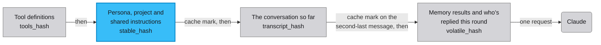

# Reading your cost and cache numbers

This is for anyone who wants to know what their chats cost and where
the money goes. The Spend page splits your spend by where it came
from, and the cheap model that writes titles and summaries has its own
spend record. Every model in a chat has a seat, and each Claude seat
writes one line to the log on every call saying what its prompt cache
did, with none of your words in it. None of that changes what gets
cached, which model answers, or what you're billed.

Crossband lays out each Claude seat's prompt to suit Anthropic's
cache. Anthropic can keep the start of a request between calls and
charge less to read it back, which it calls
[prompt caching](https://platform.claude.com/docs/en/build-with-claude/prompt-caching).
Crossband splits the seat's system prompt into a part that stays the
same and a part that changes every message, and a cache mark after the
first part tells Anthropic to keep everything before it. A fresh
memory result or a new reply from another seat then leaves the large
part cached. That's a change to how the prompt is laid out and no
promise about your bill. Whether it cuts cache writes on your traffic
is what the log line lets you check, with your own before and after
sample. Nobody has published a number, so don't repeat one.

## Where the money goes

The Spend page's By source table splits your spend into these rows.

| Source | What it is | How it's billed |
|---|---|---|
| **Model turns** | Every reply from a seated model, Claude and GPT alike. | Metered on your API key, always. |
| **Coding agent** | A turn by a Claude Code guest you summoned into the chat. | Your API key or your [Claude Code subscription](https://code.claude.com/docs/en/costs), whichever the turn recorded. |
| **Utility (background model work)** | Rolling summaries, auto-titles and project distillation, plus the room and voice scans. | Metered on your API key, when a utility model is set. |

The cache log line covers the Claude seats in Model turns and nothing
else. A GPT seat talks to the
[OpenAI Responses API](https://developers.openai.com/api/reference/resources/responses),
which has no cache mark to instrument. A coding agent turn goes through
its own code, in `backend/guest.py`, which records the turn's cache use
as `cache_creation_input_tokens` from the usage Claude Code reports and
writes no cache log line.

Every cost lands in one of three columns that are never added
together: metered on a key, covered by a subscription, or unknown.
Whether a coding agent turn was metered or covered by the subscription
is stored on it as `usage_json.auth`, and
[A recorded dollar is not a charged dollar](../ARCHITECTURE.md#a-recorded-dollar-is-not-a-charged-dollar)
explains how the columns stay apart.

A utility call is a single call with no streaming and no prompt
caching, so its token counts are the whole story. The default utility
model is `claude-haiku-4-5`. The By producer table on the same page
shows the same money as Utility (titles/summaries).

## How a Claude request is laid out

Every time a Claude seat replies, Crossband sends one request made of
four blocks. A round is one pass where each seated model gets a turn
to reply, and the blocks come in this order.

1. The tool definitions.
2. The stable system block: the seat's persona, the project
   instructions and the shared instructions. It reads the same on
   every call for that seat, project and round.
3. The conversation so far.
4. The volatile block: the memory summary, memory fetched for this
   message, the delegation note, the memory-write warning, and who has
   already replied this round. The delegation note says a summons is
   already claimed, and the warning appears when the memory service
   isn't healthy. The block changes on nearly every call.

Crossband puts a cache mark at the end of the stable block and another
on the second-last message of the conversation. The cache works on the
start of the request, called the prefix, so everything before a mark
can be stored and read back on the next call. A change anywhere before
a mark throws away everything from that point on, and the next call
stores it again.

The volatile block comes after both marks, so it can change freely
without touching what's stored. A model that accepts a system turn at
the end of the conversation gets it as one, and the others get it
added to the end of the last user turn, framed as text Crossband
assembled.

Storing a block costs more than reading it back. Anthropic charges
1.25 times the
[normal input price](https://platform.claude.com/docs/en/about-claude/pricing)
to write a block into the cache and a tenth of it to read the block
back, so one write costs as much as twelve and a half reads. A cache
pays off when a prefix is written once and read many times. The Spend
page shows this as a read to write ratio, per model, under Prompt
cache health.

The chat summary stays in the stable block. When the app folds older
messages into the summary, the same database statement moves
`summary_upto`, the point the transcript is sent from, so a new
summary always comes with a new conversation prefix. Moving it to the
volatile block would cost uncached tokens on every turn to prevent a
miss it isn't causing.

Each block has a fingerprint in the log line, so you can tell which
one changed between two calls.



## The cache log line

Every request a Claude seat makes writes one line to the log, at
`INFO` level, from the `crossband.providers` logger, tagged
`claude_chat_cache`. When a model calls a tool, Crossband runs it and
calls the model again with the result. Each of those calls is a tool
round, and each writes its own line.

```
claude_chat_cache speaker=<slug> model=<model-id> chat=<int> tool_round=<int>
  tools_hash=<16-hex> tools_n=<int> changed=<csv|none>
  stable_hash=<16-hex> stable_chars=<int>
  volatile_hash=<16-hex> volatile_chars=<int>
  transcript_hash=<16-hex> ttl=<label>
  thinking=<type|none> effort=<label|default>
  input_tok=<int> cache_read_tok=<int>
  cache_write_5m_tok=<int> cache_write_1h_tok=<int>
  output_tok=<int>
```

### Nothing in it is your text

No prompt or transcript text is ever written to the log, and no code
path in this feature can write chat content to it. Each `_hash` field
is the first 16 characters of a SHA-256 fingerprint of one block, made
by `_content_hash` and `_messages_hash` in `backend/providers.py`. A
fingerprint proves whether a block changed between two calls and can't
give the text back. Each `_chars` field is a character count, and the
token and cache-write counts come straight from the `usage` and
`cache_creation` fields on
[Anthropic's response](https://platform.claude.com/docs/en/api/messages).

### What each field means

- `speaker` and `model`: the seat that made the call, by its slug,
  and the model id it used. A slug is the short name the app gives a
  seat.
- `chat`: the chat's id. Switching chats changes the whole prefix,
  and this field is what tells a switch apart from a real break.
- `tool_round`: which tool round this call was. A plain reply with no
  tool calls is round `0`, and a reply that used tools produces
  several lines for one visible message.
- `tools_hash` and `tools_n`: a fingerprint of the tool definitions,
  and how many were sent. A change to the tools stores everything
  behind them again while every other fingerprint stays the same. The
  app adds and removes `summon_claude_code` as a summons is claimed
  and released, so that's one ordinary way the tools change.
- `changed`: which blocks differ from this seat's previous call in
  this chat, as a comma-separated list drawn from `tools`, `stable`,
  `volatile` and `transcript`. It reads `none` when nothing changed,
  and `first-call` on a seat's first call in a chat since the app
  started.
- `stable_hash` and `stable_chars`: the stable system block. The
  value holds for a seat, project and round unless you edit the
  persona or the instructions, or the project's memory notes change.
- `volatile_hash` and `volatile_chars`: the volatile block. Expect it
  to change on nearly every call.
- `transcript_hash`: the conversation as sent, fingerprinted before
  the volatile block joins it, because hashing the tail in would show
  churn on every call. It has the same value on every tool round of
  one reply. Compare it across calls to tell whether the
  conversation's cache mark saw the same prefix or a new one.
- `thinking` and `effort`: what was sent on this call. `thinking` is
  the thinking block's type, or `none`, and `effort` is the seat's
  reasoning effort, or `default`. Both change the request without
  changing any fingerprint, so a miss they cause would otherwise have
  no visible reason.
- `ttl`: how long a stored block lives before Anthropic drops it. It
  always reads `5m-ephemeral-default`, which is the constant
  `providers.CACHE_TTL_LABEL`, a label for what the code does and
  never a measurement. Anthropic keeps a block for five minutes when a
  request sends no `ttl`, and Crossband sends none anywhere it puts a
  cache mark, the `cache_control` field. The field exists so a change
  to that lifetime would show here. A one-hour lifetime is not
  enabled, and turning it on would need its own code change, its own
  evaluation from these numbers, and its own PR.
- `input_tok` and `output_tok`: tokens sent at full price, and tokens
  the model wrote back.
- `cache_read_tok`: tokens read back from the cache on this call.
- `cache_write_5m_tok` and `cache_write_1h_tok`: tokens written into
  the cache, split by lifetime, from the `cache_creation` breakdown
  Anthropic returns. The one-hour column should read `0` on every
  line. If it doesn't, that's worth reporting, because it would mean
  the API did something Crossband didn't ask for.

The four fingerprints and `changed` are also saved on the message as
`usage_json.cache_prefix`, so you can query them from the database as
well as the log.

### Where the line goes

The line lands in `data/service.log` when the app runs under
[launchd](https://developer.apple.com/library/archive/documentation/MacOSX/Conceptual/BPSystemStartup/Chapters/CreatingLaunchdJobs.html),
the supervisor that keeps it running on macOS, or in your terminal
when you run `./start.sh` yourself. That's because these are ordinary
calls to Python's
[`logging`](https://docs.python.org/3/library/logging.html) module
under the `crossband` logger. [docs/OPERATIONS.md](OPERATIONS.md)
covers the supervisor and the log file.

To see the lines, set `CROSSBAND_LOG_LEVEL=INFO` for the length of a
sampling session, then unset it. By default only warnings and errors
from the app's own code reach the log, so these lines are silent until
you turn them on. Any standard level name works, and capitals don't
matter. The setting changes what's written to the log, never what gets
cached, priced or billed. [Uvicorn](https://www.uvicorn.org/), the web
server the app runs in, has its own request log, which is set up
separately and unaffected.

## The database has the same numbers

You can check cache behaviour after the fact, even when the log line
was off at the time. Every reply stores its cache counters on the
message in `messages.usage_json`, as `input`, `cache_read`,
`cache_creation` and `output`, summed across the reply's tool rounds.
The database is a SQLite file, `data/chat.db`, and the
[`sqlite3` shell](https://sqlite.org/cli.html) reads it directly.

```sh
sqlite3 data/chat.db "SELECT json_extract(usage_json,'$.model'),
  json_extract(usage_json,'$.input'), json_extract(usage_json,'$.cache_read'),
  json_extract(usage_json,'$.cache_creation') FROM messages
  WHERE usage_json IS NOT NULL ORDER BY id DESC LIMIT 20"
```

Healthy caching shows `cache_read` at about the size of the
conversation, with a small `cache_creation`. A large `cache_creation`
on every reply means the prefix is being thrown away and stored again
each time. The log line is still the richer view, because it
fingerprints each block and shows which lifetime a write landed in,
but it's a sampling tool and the database is the record.

## When a cache write is repeated

A repeated cache write on its own doesn't mean anything is broken. Two
ordinary causes produce the same numbers, and a read to write ratio
can't tell them apart.

1. The content changed. A different `stable_hash` between two calls
   for the same seat and round means the persona, the project
   instructions or the shared instructions changed, because you edited
   them or the project's memory notes were rebuilt. A fresh write
   there is correct.
2. The stored block expired. The same `stable_hash` on two calls more
   than five minutes apart still costs a fresh write, because
   Anthropic drops a block after five minutes. A slow conversation, or
   you stepping away between messages, produces this with an unchanged
   prompt.

To tell them apart, compare `stable_hash` across consecutive lines for
the same `speaker`. The same hash with a write still happening means
the block expired, or this was the first write for that content. A
different hash means the content changed somewhere before the cache
mark.

Check `volatile_hash` the same way to see whether the split is doing
its job. A `volatile_hash` that changes every call while `stable_hash`
holds across a short burst of messages is the shape you want.

## How utility calls are counted

Two places write utility spend, and they share one pricing step,
`llm_util.price_utility_call`, so neither can price a call differently
from the other.

`chat_memory._run_utility` covers the chat's own uses, with `kind` set
to `summarize`, `title` or `distill`. The rolling summary folds older
messages into a summary once the unsummarised part of the transcript
grows too large. The auto-title names a chat from its content, and
project distillation folds a chat's new messages into the project's
memory notes.

`llm_util.utility_complete_logged` covers the room and voice scans,
with `kind` set to `command_scan`, `intro_scan`, `correction_scan`,
`depth_scan` or `mismatch_check`. A scan has a chat id but no open
database connection, so that writer opens its own on a worker thread.

Each real call writes one row to `utility_usage` and commits it at
once. The row holds `chat_id`, `kind`, `model`, `input_tokens`,
`output_tokens`, `cost`, `provenance` and `created_at`. It's written
whatever the caller does with the reply, because a title that comes
back empty was still a call that cost money.

The scan writer swallows its own failures. Both scan callers wrap
their whole turn in a handler that abandons the remaining work, so a
failed spend insert would otherwise cost you a name correction or a
mismatch flag. The reply is returned either way.

A busy room-mode turn can fire four scans, and the Spend page folds
every kind into one utility line, so room mode makes that line grow.

When there's no key for the utility model, no call goes out and
nothing is logged. The app carries on without the summary or title and
says nothing.

Two things to know when you read the numbers:

- `cost` can be empty. A utility model missing from the local price
  table is recorded with no cost, and the Spend page shows it as "not
  tracked" and never as a silent `$0.00`. That's the same rule
  `voice_usage` follows.
- `provenance` says where the cost figure came from, and it's written
  once, when the call happens. For a Haiku-family model it's
  `rate_card_estimate`, a figure computed from the local price table
  and never a billed amount. A later edit to that table can't change
  what an existing row's cost meant when it was written, and every
  cost source in the app keeps the provenance it was computed under.
  A row with no provenance, written before the column existed, is
  priced against the live table when it's read.

The Utility line on the Spend page covers calls made since the table
existed, never your lifetime utility spend. Calls made before the app
kept this table have no row, because their token counts were never
kept and can't be rebuilt. A low Utility total on an old install can
mean most of its history came before the table, so it's no proof that
utility calls are cheap.

## Checking your own before and after

This is a safe way to collect your own evidence without exposing chat
or credential content. Every field involved is content-free, so
nothing needs redacting, as long as you don't rename your chats or
seats to something that identifies you.

Decide what you're comparing, such as this build against a future
change, and use a comparable conversation for both samples. That means
the same rough length and pace, and best of all the same scripted
messages replayed into a scratch chat. Comparing a two-message chat
with a fifty-message chat tells you nothing.

1. Turn on the log line for the session by adding this line to
   `config.local.json`. That file is your own gitignored config layer,
   read the same way whether you run the app yourself or under the
   supervisor, so the supervisor's plist stays untouched. The layers
   are the defaults, then `config.json`, then `config.local.json`,
   then the environment, and each one overrides the last.
   ```json
   { "log_level": "INFO" }
   ```
   Restart to pick it up, with `./start.sh` if you run it yourself,
   or under the supervisor with this command.
   ```sh
   launchctl kickstart -k gui/$(id -u)/dev.crossband.server
   ```
   A one-off run without touching config works too.
   ```sh
   CROSSBAND_LOG_LEVEL=INFO ./start.sh
   ```

2. Run your comparison conversation, then pull out the telemetry
   lines for that window.
   ```sh
   grep 'claude_chat_cache' data/service.log > sample-before.log
   ```
   If the app restarted during the sample and the log had passed
   10MB, the earlier lines are in `data/service.log.1`, so grep both
   files. The file is safe to attach to an issue or share as it is,
   because it holds only fingerprints, character counts and token
   counts.

3. Summarise it with three commands.
   ```sh
   # how many distinct stable-block fingerprints the sample saw. If you didn't
   # touch the persona, project or instructions, this stays small: one per
   # seat across the whole sample.
   grep -oE 'stable_hash=[0-9a-f]+' sample-before.log | sort -u | wc -l

   # cache read and write token totals for the sample
   grep -oE 'cache_read_tok=[0-9]+' sample-before.log | grep -oE '[0-9]+' \
     | awk '{s+=$1} END {print "cache_read_tok total:", s+0}'
   grep -oE 'cache_write_5m_tok=[0-9]+' sample-before.log | grep -oE '[0-9]+' \
     | awk '{s+=$1} END {print "cache_write_5m_tok total:", s+0}'
   ```

4. Repeat steps 1 to 3 for the after condition, with the same
   scripted conversation, to get `sample-after.log` and its own
   totals.

5. Compare the shape of the two samples, and don't turn it into a
   dollar claim:
   - Did the number of distinct `stable_hash` values fall for the same
     conversation shape? Fewer for the same content means the stable
     block survived more calls.
   - Did the total `cache_write_5m_tok` fall against the total
     `cache_read_tok`, or against `input_tok`?
   - Check the Spend page's Model turns row for the same window as a
     sanity check. It reports cost, never a cache-hit ratio, and cost
     depends on far more than caching, such as which model, how long
     the replies were and how many tool rounds ran.
   - Report the comparison as hash churn and read to write ratio. Give
     a percentage or a dollar figure only if you've confirmed the
     billed numbers on the Spend page over a window long enough to
     mean something. A two-sample log comparison checks a hypothesis
     and doesn't measure a saving.

6. Turn the log level back off, by removing the `config.local.json`
   key or unsetting the variable, and restart, so the service goes
   back to its quiet default.
