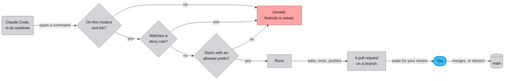

# Guest permissions

You can summon Claude Code into a chat with the `summon_claude_code`
tool. It joins as a guest for one turn, in one repo, and then it leaves.
There's no terminal and nobody to click "approve", so everything the
guest may do is decided in code before it starts, and every visit gets
the same rules. Read this before you turn on implement mode, and before
you change the lists in `backend/guest.py`.

## What a visit is

A summons queues one turn. The guest speaks after the other models have
finished the round, with everyone's replies in view, and only one guest
can be working in a chat at a time. When a task is unclear, the guest
ends its turn with questions. Answer them and summon it again with
`continue_last`, and it picks up its own session where it left off.

The guest never works in your checkout. Each visit gets its own git
worktree. A worktree is a second copy of the repo in a temporary folder.
It shares the repo's history, branches and remotes, but the files on
disk are its own. Before a visit starts, the app fetches from origin and
checks the worktree out at the newest `main`, or at your local `main`
when there's no remote. A summons can also name a branch or a pull
request, and then the worktree is checked out at that commit before the
guest starts, so a review reads the real files.

A fresh checkout holds only what's committed, so a gitignored file like
`.env` isn't in it. Your `.venv` and `frontend/node_modules` are linked
in from your checkout, so the tests can run without a reinstall. When
the visit ends, the worktree is removed, and a branch the guest pushed
survives. Each worktree is keyed by the repo, the chat and the visit, so
two visits never share files, and a visit can't collide with you or
with another chat's guest.

## The two modes

Investigate is the default, and it's read-only. The guest has three
tools: `Read`, `Grep` and `Glob`. It has no shell and can't write a
file, so it reads, reasons and answers, or writes a plan for a later
visit to carry out. It can open any file it can name.

Implement is off until you set `code_allow_writes`. The guest can then
make a branch, edit files, run the tests, commit, push the branch and
open a pull request. It can never merge and can never push to `main`.
You review and merge every pull request.

Both modes mount every MCP server in `code_mcp`, and each one whole, so
every tool the server offers is allowed, write tools included.
`code_mcp` is empty out of the box, so a fresh install mounts none. See
[Giving a guest read access to memory](#giving-a-guest-read-access-to-memory).

### One diagnostic tool, on every visit

Every visit also gets one tool that needs no config, `get_diagnostic`.
Its one argument is a name from a fixed list: `health`, `models`,
`voice_latency`, `conversation_spend` or `conversation_performance`.
There's no way to pass it a URL, a path or a query. It answers whether
the memory service is reachable, which model each participant is
running, and the recent voice-turn count with latency percentiles. It
also gives what this conversation has cost so far on metered keys,
split by party, producer and provider. The answers come from the
running app's own data. It can't return a transcript, a message, a
credential or a log line, and it reaches no network. It carries no
secret, and that's why it's always on while the servers in `code_mcp`
are opt-in.

Claude and GPT have the same tool in normal chat. The guest's copy is
`backend/diag_mcp.py`, the chat's is in `backend/tools.py`, and both
share one list of names, one schema and one dispatch in
`backend/diagnostics.py`. A diagnostics question doesn't need a guest,
and a guest summoned for something else still has the tool.

### Choosing a model and an effort level

A summons can name a model tier and an effort level. The tiers are
`default`, `opus`, `sonnet` and `haiku`. The effort levels are
`default`, `think`, `think-hard` and `ultrathink`. Both are fixed lists,
checked when the tool is called, so nothing free-form reaches Claude
Code. A choice in the summons wins over `code_model` and `code_effort`
in config, and those win over Claude Code's own default. Ask for either
in the chat, and the model that summons the guest passes it along, or
set the two config keys for every visit.

Every guest reply ends with a readout of both, and the readout says how
well each is known. The model is read back from Claude Code's own
session, so it names the model that ran, whatever tier was asked for.
The effort is only what was asked for and applied, as a thinking
budget. Claude Code never reports thinking tokens back, so nothing
confirms it.

## How a command is approved

Every guest session runs with `permission_mode="dontAsk"`. A command
runs only if a rule pre-approves it. Anything else is denied on the
spot. Nothing waits for someone to approve it later, because nobody is
there to. That's why the allow list has to name the project's real
commands.

A rule is a command prefix. `Bash(git push:*)` runs anything that
starts with `git push`. A deny rule beats an allow rule, which is how
implement mode can allow `Read` in general and still deny it on `.env`.
That precedence is Claude Code's own behaviour, and this repo relies on
it without testing it. Every guest test mocks the boundary, so the suite
pins which rules are handed over and never sees a command refused.

The rules come from the running Crossband process and never from your
personal `~/.claude/settings.json`. Claude Code is started with
`setting_sources=["project"]`, so it reads only the repo's own
settings, and every worktree on any machine gets the same rules. The
repo's `CLAUDE.md` still loads, because it's part of the project
settings.



## What implement mode may run

These run without asking. Each is a prefix, so `git push` covers
`git push origin my-branch` too.

| What | Pre-approved prefixes |
|---|---|
| The Python tests | `.venv/bin/python`, `.venv/bin/pytest`, and `env -u OPENAI_API_KEY -u ANTHROPIC_API_KEY .venv/bin/python` with the two keys in either order. |
| The frontend | `npm run`, `npm test`, `npm ci`, and the same three as `npm --prefix frontend run`, `test` and `ci`. |
| Git | `git status`, `diff`, `log`, `show`, `rev-parse`, `add`, `commit`, `checkout`, `switch`, `branch`, `restore`, `stash`, `fetch`, `ls-remote`, `push`, `remote -v` and `remote get-url`. |
| GitHub | `gh issue view`, `gh issue list`, `gh issue comment`, `gh pr create`, `gh pr view`, `gh pr checks`, `gh pr diff`, `gh pr list`, `gh pr status` and `gh auth status`. |
| The live database | `sqlite3 -readonly` and `sqlite3 -ro`, for looking at live data when a task needs it. |
| Files and its own checklist | `Read`, `Grep`, `Glob`, `Edit` and `Write` anywhere except under `.github/`, and `TodoWrite`. |

The keyless test command in `CLAUDE.md` starts with `env`, so it has
its own rule, in both key orders. `env -u NAME` only unsets a variable
before the pinned interpreter, so the rule stays as narrow as
`.venv/bin/python` itself.

The SQLite rules approve only the `-readonly` and `-ro` forms, which
open the database read-only, so a stray `UPDATE` or `DROP` fails in the
engine. A bare `sqlite3 <db>`, which can write, is never approved.

## What implement mode blocks

These are `IMPLEMENT_DENIED` in `backend/guest.py`. The last row holds
in both modes. Every other row is implement mode only. A read-only visit
has no shell, so the shell rows have nothing to bite on there, and the
credential row isn't there at all.

| Blocked | Why |
|---|---|
| `gh pr merge`, `git merge`, and everything under `gh repo` | Only you merge. |
| `git push origin main`, `git push -u origin main` and `git push origin HEAD:main` | `main` moves only when you merge. |
| `git push -f`, `git push --force` and `git push --force-with-lease` | A force push can rewrite history you've already reviewed. |
| `Edit` or `Write` under `.github/`, at any depth | A pull request must not weaken the checks that review it, so the guest describes a CI change in its reply and you make it. |
| `Read` of `.env`, `.env.*`, `config.local.json`, `*.pem` and `id_rsa*` | Your keys live in them. |
| `env` and `printenv` | Dumping the environment prints every key the app holds. |
| `curl`, `wget`, `nc`, `ssh` and `scp` | No network beyond `git`, `gh` and `npm`. |
| `rm -rf`, `rm -fr`, `sudo` and `git clean` | Nothing destructive in the shell. |
| `WebFetch`, `WebSearch`, `Task`, `NotebookEdit` and `KillShell` | Off in both modes, so the guest has no web search, no web fetch and no subagents. |

Investigate mode denies `TodoWrite` as well. It has nothing to build,
so it has nothing to track. The network reach a guest keeps is `git`,
`gh`, and `npm` fetching packages when it installs or builds.

## What the rules don't protect against

The rules are guardrails against accidents. They aren't a sandbox.

A rule checks the shape of a command and never what the command goes on
to do. `.venv/bin/python` is approved, so any Python the guest writes
runs. SQLite's `-readonly` still allows dot commands like `.shell` and
`.import`, and no rule covers those. The gate that catches all of this
is your review of the pull request.

Make that gate an enforced one. Protect `main` on your git host, so the
test and audit checks must pass before anything the guest wrote can
land, and block force pushes and branch deletion outright. Check who
the protection binds while you're there. These settings often exempt
the repository owner and bind anyone pushing as a collaborator, which is
the account a guest pushes under.

A read-only guest is read-only about your repo. Its `Read` has no path
rule, so it can open any credential file it can name. What limits the
damage is where the guest stands. A visit runs in a fresh checkout, and
a gitignored file like `.env` isn't in one. That's a fact about the
worktree, and no rule enforces it.

In implement mode, the credential rules bind `Read` alone. A `Grep` or
`Glob` over `.env` is covered by no rule, in either mode. No test here
watches a read being refused.

An MCP server sits outside all of this. Whatever server you mount is
available whole, in both modes, and if it can write, so can the guest.

## Where the credential rules live

The six rules that keep implement mode out of credential files are
`Read(.env)`, `Read(**/.env)`, `Read(**/.env.*)`,
`Read(**/config.local.json)`, `Read(**/*.pem)` and `Read(**/id_rsa*)`.
They live in `IMPLEMENT_DENIED` and nowhere else. Investigate mode's
deny list is `DENIED_TOOLS`, which names whole tools: `Bash`, `Write`,
`Edit`, `NotebookEdit`, `WebFetch`, `WebSearch`, `Task`, `TodoWrite` and
`KillShell`. It holds no `Read` rule of any kind, and its allow list is
the bare `Read`, `Grep` and `Glob`.

If you want the file rules in both modes, add them to `DENIED_TOOLS` as
well, and update `docs/GUEST_PERMISSIONS.md` and `SECURITY.md` in the
same change. `tests/test_guest.py` pins the behaviour of both modes, and
pins that the rule list in both docs matches the code, so the edit turns
a test red until the docs catch up.

## GitHub credentials are a separate layer

The rules decide what may run. They don't log the guest in anywhere.
`git push` over an HTTPS remote and every `gh` command need a GitHub
credential. If the host blocks Keychain access, which is common when
Crossband runs in a restricted environment, they fail with an HTTPS
error, `OSStatus -26276`, however the permissions are set.

Fix it once, either way:

1. Put a GitHub token in Crossband's environment, such as `GH_TOKEN=…`
   in `.env`. The guest inherits `GH_TOKEN` and `GITHUB_TOKEN`, so `git`
   and `gh` log in without the Keychain. `gh auth login --with-token`
   works too.
2. Or point the remote at `git@github.com:<owner>/<repo>.git` with
   `git remote set-url origin …`, so a push uses your own `ssh` key and
   agent.

The Claude login, `CLAUDE_CODE_OAUTH_TOKEN`, signs the guest in to
Claude. It does nothing for GitHub.

### What the guest inherits from the environment

The guest starts with every inherited variable that starts with
`CLAUDE` or `ANTHROPIC` blanked. That way it logs in like a fresh
`claude` in a clean terminal, and a subscription turn can't fall back
onto your metered key. Two survive:

- `CLAUDE_CODE_OAUTH_TOKEN` stays. It's the supported headless login,
  made with `claude setup-token`, and `.env` is where it lives. Blank it
  and the guest can't log in to Claude at all.
- With `code_use_api_key` set and an `ANTHROPIC_API_KEY` present, that
  key is put back. Guest turns then bill your metered key in place of
  your Claude Code subscription, and each reply reports the real cost.

`GH_TOKEN` and `GITHUB_TOKEN` start with neither prefix, so they pass
through untouched. `MAX_THINKING_TOKENS` is added when a summons or the
config asks for an effort level other than `default`.

## Giving a guest read access to memory

The usual first entry in `code_mcp` is Membro's `membro` recall
server, which offers recall and `save_memory`, a fact proposal that
waits for your review. Add it in `config.local.json`, so your paths
never enter the public repo.

To let a guest also audit memory fact by fact, listing fact IDs,
statuses and the review queue, wire in Membro's authenticated read
server, `membro-admin`. It speaks HTTP, so it avoids the fragility of
opening the database over stdio.

```jsonc
// config.local.json, where <repo> is Membro's checkout, such as /Users/you/dev/membro
"code_mcp": {
  "membro": {
    "command": "<repo>/.venv/bin/python",
    "args": ["-m", "memory_service.mcp_server"],
    "env": { "PYTHONPATH": "<repo>" }              // required
  },
  "membro-admin": {
    "command": "<repo>/.venv/bin/python",
    "args": ["-m", "memory_service.mcp_admin_server"],
    "env": {
      "PYTHONPATH": "<repo>",
      "MEMORY_AUTH_TOKEN": "${MEMORY_AUTH_TOKEN}",   // resolved from Crossband's env
      "MEMORY_API_URL": "http://127.0.0.1:8901/v1"
    }
  }
}
```

### Why `PYTHONPATH` is required

Membro runs from its checkout and is never pip-installed, so naming its
interpreter doesn't put `memory_service` on the path. Without
`PYTHONPATH`, the server exits at spawn with
`ModuleNotFoundError: No module named 'memory_service'`, and the guest
arrives with the tool missing. `-e PYTHONPATH=<repo>` is the form
Membro's own `README.md` gives for `claude mcp add`, and the config is
that form written out.

### Naming a secret without pasting it

Any `${NAME}` inside a `code_mcp` server's `env` values is replaced
with that variable's value from Crossband's own environment when the
guest launches. `"Bearer ${TOK}"` works as well as a bare `"${TOK}"`,
so a secret is named in config and never pasted into it. Put the real
value in Crossband's `.env`, as `MEMORY_AUTH_TOKEN=…`. This works in
`env` only. A `${VAR}` in `command` or `args` is passed through as
written and never resolves. A variable that isn't set becomes an empty
string, so a typo leaves the tool with no credential at all, and the
literal `${VAR}` never leaks.

### The tradeoff

Wiring in an authenticated read server means every guest carries that
token and can read exact rows, personal facts included, and those rows
land in the guest's transcript. If that guest then opens a pull request,
the facts can ride along in it. The write-tool rules exist to keep
personal data out of a pull request, and this is the same risk. Turn
it on when you want guests auditing memory, and leave it off
otherwise. It never grants write, approve or dismiss. Those
stay owner-only, by the server's own rules.
