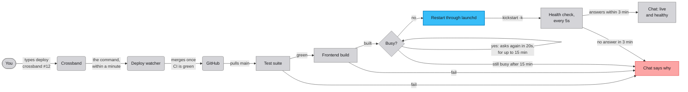

# Keeping Crossband running

Crossband runs as a service on your computer, on port 8902, and if
you leave it running on a home server and use it from your phone, it
needs to look after itself. It should start when the computer starts,
come back when it dies, and survive a reboot. A crash would otherwise
leave the app dark until you noticed, with an empty sidebar in the
meantime, since the chat list comes from the server.

A supervisor is the program that does that looking after. It starts
another program and keeps it running. On macOS the built-in one is
[launchd](https://developer.apple.com/library/archive/documentation/MacOSX/Conceptual/BPSystemStartup/Chapters/CreatingLaunchdJobs.html),
and the repo ships a one-command installer that hands
Crossband to it.

## Install the supervisor (macOS)

```sh
ops/install-supervisor.sh
```

That's all there is to it. The script fills your computer's real paths
into a template, `ops/dev.crossband.server.plist.template`, and writes
the result to `~/Library/LaunchAgents/dev.crossband.server.plist`,
which is the file that tells launchd what to run. Then it stops any
copy of the app you started by hand and gives the one real copy to
launchd. The template holds no personal path, so nothing about your
machine is ever committed.

From then on launchd owns the service. It starts the app at login,
restarts it within about a second if it exits for any reason, and
brings it back after a reboot. If the app crashes as soon as it starts,
launchd waits ten seconds between tries, so a broken boot shows up as a
slow, steady retry in `data/service.log`.

launchd calls a job like this an agent, and this one is named
`dev.crossband.server`. You'll see `gui/$(id -u)` in every `launchctl`
command that follows, which tells launchd to look in your own login
session.

## Everyday commands

Run these from the repo folder, since the log path and the installer
are relative to it. The installer prints the log's absolute path when
it finishes.

```sh
# restart it, after a git pull or to pick up .env changes
launchctl kickstart -k gui/$(id -u)/dev.crossband.server

# is it running, and as which pid?
launchctl print gui/$(id -u)/dev.crossband.server | grep -iE 'state|pid|program'

# follow the log
tail -f data/service.log

# stop supervising, which also stops the service
launchctl bootout gui/$(id -u)/dev.crossband.server

# start supervising again
ops/install-supervisor.sh
```

The log rotates at each boot once it passes 10MB, and the one it
replaced is kept beside it as `data/service.log.1`.

Once the supervisor is installed, launchd holds port 8902, so
`./start.sh` stops being the way to run the app day to day. If you run it
anyway it waits ten seconds for the port to come free, then refuses
with "✗ something is still listening on port 8902 after 10s (pid …)".
Ignore that message's advice to kill the process, because launchd
would only start it again a second later. Use the restart command
instead. `./start.sh` becomes the right command again after you've run
`launchctl bootout` on the agent.

## Backups

The app backs up its database and its learnt voices on its own, into
`data/backups/`. How often, how many it keeps, and an optional mirror
folder are settings, and [docs/CONFIG.md](CONFIG.md#backups) lists
them.

## Deploying a change

A deploy has to restart the service through launchd, because launchd
is the process's one owner. If you script deploys, end the script with
the same restart command:

```sh
launchctl kickstart -k gui/$(id -u)/dev.crossband.server
```

That command fails when there's no agent to kick, so fall back to
`./start.sh` when the agent isn't loaded. Either way you can't end up
with two copies by accident. The running copy holds a lock file in
`data/`, which stops a second copy opening the same database, and
`start.sh` checks the port before it starts. The worst case is a deploy
step that fails loudly.

A deploy can also ask whether the service is busy before it restarts.
Send `GET /api/busy` from the same computer and it answers
`{"busy": true, "reasons": [...]}` with no login needed, the same rule
as the health route, `/api/auth/session`, which a deploy checks to see
that the app is up. Busy means a round is still generating in any chat,
a voice capture is live, a Claude Code guest is at work, or a sync of
people to memory, a benchmark, an import or a backup is part way
through. The reasons are fixed labels and never carry anything from a
chat. Wait for `"busy": false`, then restart. A service too broken to
answer is restarted anyway.

### How a deploy watcher does it

A deploy watcher is a program on the same computer that merges a pull
request once you've approved it and then restarts the app. The one
that ships Crossband's own changes does just this, but it isn't part
of Crossband, because most installs should never have an app that
merges and restarts itself. [docs/PRODUCERS.md](PRODUCERS.md) has the
rules for writing one.

It starts when you type `deploy crossband #12` in a chat. Within a
minute the watcher reads the command, checks that the pull request's
CI is green, and merges it as one commit. It then pulls main into its
checkout, installs any new dependencies and runs the test suite. If the
tests pass it builds the frontend while the old server is still
running, so the gap while the app restarts is only Python starting up.
Before that restart it asks the busy route every twenty seconds, for
up to fifteen minutes, posting one line in chat while it waits. Once
the app is free it restarts it through launchd and asks the health
route every five seconds, for up to three minutes, until the new
process answers. One line in chat then says the app is live and
healthy.

When something fails, nothing restarts. If the tests, the build or the
busy wait fail, the old code keeps running and both the chat and the
pull request say why. If the new process doesn't answer within three
minutes, the chat says to check the machine.



## Stopping it

A stop finishes within fifteen seconds. Anything still in flight, a
chat round part way through generating or a live voice call, gets that
long to finish, and then the app exits regardless. A tab that was
watching the old process reconnects on its own and catches up from the
database, so nothing is lost across a restart.

Change the fifteen-second ceiling with `CROSSBAND_SHUTDOWN_TIMEOUT_S`,
or `"shutdown_timeout_s"` in `config.local.json`. Raise it if you'd
rather a long round always finish, or lower it for a deploy loop that
wants a fast, predictable stop.

Here's why a stop is quick at all. It begins with `SIGTERM`, the signal
`kill` and launchd send to ask a process to stop. Every open browser
tab holds a connection to `/api/events/stream`, which is how new
messages reach the page, and that connection never ends on its own.
[Uvicorn](https://www.uvicorn.org/), the web server the app runs in, waits for every open
connection to finish before it exits, so the app ends those streams the
moment the signal arrives and that wait is over in milliseconds.

A restart is forgiving in two more ways. Startup waits up to ten
seconds for a lock still held by the copy that's shutting down, so a
restart a second too early still succeeds. If the lock is still held
after that, the message says whether the process holding it is alive
and gives the command to end it. The message "Another instance is
already running against this data directory" means that process is
stuck draining a connection, and `kill -9` on it ends it.

## Turning up the log for a while

By default only warnings and errors from the app's own code reach
`data/service.log`. The app also writes a line per Claude call saying
how much of it came from cache, with no chat content in it, and those
lines sit at `INFO` level, so they're quiet by default. To see them,
set `CROSSBAND_LOG_LEVEL=INFO`, or `"log_level": "INFO"` in
`config.local.json`, restart, and unset it when you're done. That
changes only what's written to the log. Nothing about what's cached,
priced or billed changes with it, and
[docs/COST_TELEMETRY.md](COST_TELEMETRY.md) has the before-and-after
workflow.

## Not on macOS?

The same idea works with
[systemd](https://www.freedesktop.org/software/systemd/man/latest/systemd.service.html)
on Linux: a unit with `Restart=always`
and `WantedBy=default.target`. The repo doesn't ship a unit file, but
the plist template's `ProgramArguments` run `bash start.sh` with the
repo as the working directory, and those map straight onto a systemd
`ExecStart` and `WorkingDirectory` if you write one.
