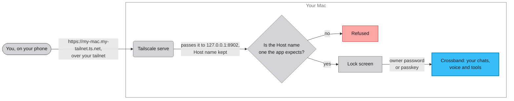

# Using the app from your phone

Out of the box, the app answers only on the computer it runs on. You
can use it from your phone, voice included, without putting it on the
internet and without your conversations passing through anyone else's
service. You need Tailscale and about ten minutes. There's no script
for it, so the steps are by hand.

[Tailscale](https://tailscale.com) makes a private network between
your own devices. That network is called a tailnet, and only devices
signed in to your account are on it. One of its commands,
`tailscale serve`, gives something running on your Mac an HTTPS
address that only your tailnet can reach. In short: run the app as
usual, have Tailscale serve it, tell the app to expect its new name,
and open that name on your phone.

## What you're agreeing to

Once the app is on your tailnet, the tailnet is its outer boundary.
Any device on it can reach the app's lock screen. Behind that screen
are your conversations, your API credit, and your repositories if
you've set up the coding guest. The lock screen asks for your owner
password, or for your passkey once you've added one. If you haven't
set a password yet, a device on your tailnet is asked to set one and
can do nothing else. Setting one needs the recovery secret from the
Mac.

Two rules still hold. The lock screen is the second layer, and it
doesn't make the app fit for a wider network.

- Only your own devices go on that tailnet. If you wouldn't hand
  someone your unlocked laptop, don't add their device.
- Use `tailscale serve`, never `tailscale funnel`. Funnel is the public
  version of the same command. It would put the app on the open
  internet, with no rate limiting, no audit log, and a login page
  facing the whole world. Check any time with `tailscale serve status`.
  It must say "tailnet only".

The app isn't built to face the internet, and having a login doesn't
change that. Past the tailnet, you're on your own.

## Why it has to be HTTPS

A browser will only give the microphone to a page it loaded over
HTTPS, or from the computer's own address, `127.0.0.1`. On plain HTTP,
at an address like `http://<mac-ip>:8902`, the mic is off and
everything else works. Tailscale serve gives the app a real HTTPS
address, which is what lets voice work from your phone. The same
command is what keeps the app off the internet, so one step does both.

## Setup

The steps use the `tailscale` command. On a Mac it lives inside the
Tailscale app, at `/Applications/Tailscale.app/Contents/MacOS/Tailscale`,
and isn't on your `PATH`, so run it by that full path.

1. Install Tailscale on your Mac and on your phone, and sign in to the
   same account on both. The free personal plan is enough.

2. On the Mac, check that both devices are on the tailnet.

   ```sh
   tailscale status
   ```

   You should see your Mac and your phone in the list.

3. Start the app on the Mac, as usual.

   ```sh
   ./start.sh
   ```

   It listens on `127.0.0.1:8902`, the Mac's own address, and stays
   there through every step. Tailscale will pass requests on to it.

4. Have Tailscale serve it over HTTPS.

   ```sh
   tailscale serve --bg https / http://127.0.0.1:8902
   ```

   Tailscale prints "Available within your tailnet:" and the address,
   something like `https://my-mac.my-tailnet.ts.net/`. That's your
   Mac's tailnet name. From now on Tailscale handles the HTTPS side at
   that name and hands each request to the app at `127.0.0.1`.

5. Tell the app to expect that name. Add this line to `.env`, with
   your own name in it, and restart the app.

   ```
   CROSSBAND_TRUSTED_HOSTS=my-mac.my-tailnet.ts.net
   ```

   Without it, the app refuses everything that arrives under the new
   name, and the phone sees one line:
   "This app serves localhost (and configured trusted hosts) only."
   The Mac's own address keeps working either way.

6. Check that it's tailnet only.

   ```sh
   tailscale serve status
   ```

   The line with your address must say "tailnet only".

7. On your phone, open the address.

   ```
   https://my-mac.my-tailnet.ts.net
   ```

   If you haven't set an owner password yet, the app asks you to set
   one now, and to prove it's you with the recovery secret. That secret
   is `CROSSBAND_RECOVERY_SECRET` in `.env` if you set one, or the
   random one the app printed in its startup output on the Mac. If a
   password is already set, you get the lock screen, and the password
   unlocks it.

Once you're in, allow the microphone when the browser asks, and voice
works as it does on the Mac. To unlock with Face ID or Touch ID next
time, add a passkey from the phone under Settings, then Passkeys. A
passkey belongs to the address it was made at, so one you added on the
Mac won't offer itself at the tailnet name.

## Where a request goes

Tailscale serve takes each request at the HTTPS address and passes it
to the app at `127.0.0.1`, so the app sees a connection from the Mac
itself. The request still carries the name it was sent to, in a field
every web request has, called Host. The app checks that field on every
request and refuses any name it doesn't know. The check is there
because a hostile website can point its own name at `127.0.0.1`, and a
browser would then treat that site as your app. The Host field still
names the other site, so the app says no.

Only devices signed in to your tailnet can look up or reach the
tailnet name, so the tailnet is the outer fence. Inside it, the lock
screen is what asks who you are, with the owner password or a passkey.



Two more checks run behind that.

A browser marks every ordinary request with where it came from, in a
field called Sec-Fetch-Site. A request to an `/api/` route marked
`cross-site` is refused, so a page on another website that has learnt
your tailnet name can't drive the app from its own address. Only that
one value is refused. A page the browser calls `same-site`, meaning
one served under another name on your tailnet domain, gets through.

Voice runs over websockets, and that check never sees them. The two
voice relays, `/api/voice/tts` and `/api/voice/stt-stream`, do their
own checking, in `backend/routers/voice.py`. They check the Host name
against the same list, and a second field, called Origin, which the
browser fills with the address of the page that opened the websocket.
A page can't forge Origin. An Origin whose name isn't on the list is
refused, so a page on another site can't open a relay and spend your
ElevenLabs credit, even from a phone that's on your tailnet. A caller
that sends no Origin at all is let through, the same as over HTTP.
That means a script or `curl`, never a browser. For those the tailnet
is the whole fence, so treat the tailnet name as semi-private.

Any device on your tailnet can reach every `/api/` route. The tailnet
is the fence, and the lock screen is the only lock behind it. Your own
scripts and the deploy watcher post into chats through two routes,
`/api/ingest` and the deploy-notice route, and each request carries
`ingest_token`. [SECURITY.md](../SECURITY.md) calls that the machine
side-channel. Once an owner password is set, every such script needs
the token, on the Mac itself included, because a script has no browser
session.

Nothing faces the internet, and no messaging provider such as Meta or
Twilio sits in the path. Your conversation goes only to the AI
providers you've set up.

## Membro on the tailnet too

None of this is required. Crossband talks to Membro over the Mac's own
address, so from your phone, recall, summary, search and saving facts
all keep working whether or not Membro is on the tailnet.

[Membro](https://github.com/shawn-durrani/membro), the memory service
on port 8901, also answers only on its own computer out of the box,
and it has its own supported way onto a tailnet. Its settings:

- `MEMORY_TRUSTED_HOSTS` does for Membro what `CROSSBAND_TRUSTED_HOSTS`
  does here. It's a comma-separated list of the names, other than the
  computer's own, that may reach its sign-in page. A device on your
  tailnet that hasn't signed in gets the lock screen and nothing else.
- `MEMORY_TAILSCALE_SERVE=1` in Membro's own `.env` makes its
  `start.sh` run `scripts/tailscale-serve.sh` at every start. That
  script serves Membro with `tailscale serve`, never Funnel, on an
  HTTPS port of its own, `MEMORY_TAILSCALE_PORT`, which defaults to
  `8443`. Membro takes a port of its own because its admin pages link
  absolute paths. Under a `/membro` prefix those links would land on
  whatever is served at the root of the tailnet name, and on a Mac that
  also serves Crossband, that's Crossband.
- `MEMORY_TAILSCALE_BIN` tells Membro where the `tailscale` command is
  when it isn't on your `PATH`, which on a Mac is the path in
  [Setup](#setup).
- Membro always asks for its owner password, on the Mac included.
  Crossband only asks once you've set one. For Membro, the password is
  what keeps people out, and the tailnet is only a way to reach it.
  Putting it on the tailnet doesn't change where it listens or what it
  accepts as a credential.

Read Membro's own `SECURITY.md` and `docs/TUNING.md` before you turn
any of that on. The settings are Membro's, and its docs say how they
behave.
