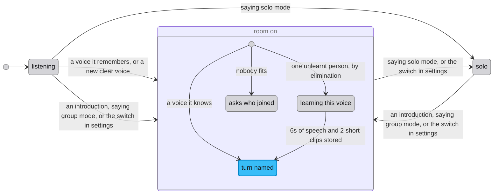

# Voice identification: where it falls short, and what to tune

Crossband can hear you and talk back. When more than one person is in
the room, it also works out who is speaking and puts a name on each
turn. To do that it keeps a short recording of each person it has
learnt, compares every new turn against those recordings on your own
computer, and names the speaker only when the match is clear. The app
calls this room mode, and the readme's
[Have more than one person in the room](../README.md#what-you-can-do)
has the short version.

The defaults were set using the voices of one family. If the app names
the wrong person, or nobody, start with
[What to check when identification misbehaves](#what-to-check-when-identification-misbehaves).

The app puts a name on a turn only when the voice check on your own
computer is sure. That check is called the matcher. When it isn't sure,
the turn stays unnamed, and no cloud service is asked to guess instead.
The only cloud transcription left in room mode runs when two people
talk over each other, to work out which words were whose.

## How the room switches on and off

The app keeps a list of who's in the room, called the roster, and
putting a person on that list is called seating them. Switching room
mode on is called arming the room.

The voice dock is the strip that holds the voice controls, and it
shows which of three states a chat is in. "listening" is the default,
where the room is off and the app switches it on by itself when it
hears a reason to. "room on · 2" means the room is on with two people
seated. "solo" means you switched the room off for this chat, and the
app won't switch it back on by itself.

The room arms itself from "listening" when:

- a voice the app remembers speaks, and it isn't yours
- a clear voice the app doesn't know speaks, and the app asks who's
  joined. This one needs your own voice learnt first, or the app
  can't tell a stranger from you.
- someone is introduced out loud
- you say or type "group mode", or use "switch on now" in the voice
  settings

Saying "solo mode" takes the chat to "solo", and so does "switch off
for this chat" in the voice settings. Either one marks everyone as
left and closes any open question about who's speaking. From "solo",
only an introduction, "group mode" or "switch on now" brings the room
back.

In solo the app still checks each spoken turn. Your voice gets your
name, a voice the app remembers gets that person's name, and a clear
voice it doesn't know is marked "voice not recognised". A turn it
can't decide on stays unmarked, the same as in "listening". None of
these switch the room on, seat anyone or ask who's joined.

Once the room is on, each spoken turn lands in one of three states.
If the voice matches a remembered person, the turn gets their name.
If only one person in the room has no learnt voice, an unmatched turn
is theirs by elimination, and it's labelled with their name and
"learning this voice". If nobody fits, the app asks who joined.

## How room mode hears what you say

The app listens for spoken introductions, like "say hi to Alex" or "my
mate Dave is here", and for the mode commands "group mode" and "solo
mode". It also hears a spoken name correction, a change to how hard a
seat should think, and "research more", which turns on
[research mode](WEB_RESEARCH.md#research-mode). A small, cheap model
reads every turn you send once and says which of these it holds, so an
unusual phrasing lands the same way a common one does. It reads typed
turns as well as spoken ones, whether or not room mode is on.

- Recognising a voice needs no wording at all. Every spoken turn gets
  a quiet voice check on your own computer, so a person the app
  already knows is recognised however they were greeted. That holds
  whether the room is on, off or solo. It holds when live
  transcription fails too. The app then sends each turn's recording to
  be transcribed, with a small copy of the turn's audio for the check,
  about 32 KB a second. With the room armed, the check compares
  against everyone the app remembers, and a remembered person who
  isn't seated yet joins the room on their first turn.
- The other door is the ask. When a clearly new voice appears and
  nothing on record explains it, the app asks who's speaking. It
  doesn't guess.

When a spoken command switches the room on or off, one system line
says what changed and what to say to undo it. When the model hears an
instruction and the room stays as it was, one system line says so,
naming what it heard and that nothing changed.

Asking the seats to hold back leaves room mode alone. "You don't need
to respond", "just listen" and "go to eavesdropping mode" aren't mode
commands, so the room stays as it was. Each seat answers with `[pass]`
until someone asks it something, and the app hides a pass. When a turn
has a question mark in it, the first seat to reply is asked once whether
the question is for the seats. People in the room asking each other
things get a second `[pass]`, and that one stands. A seat you name still
has to answer. For "solo mode" to be heard, say it by name, or say you're
on your own now, like "it's just me now".

A word you spell out letter by letter only counts as a name correction
when the turn says it's a name. "Her name's spelt S-A-M-M" counts, and
so does "it's Mateo, M-A-T-E-O", where you say the name and then spell
it. Letters on their own don't count, even when they're close to the
name of someone in the room, because a word in a game looks the same.
A word set aside changes nothing and posts no line.

If a turn is never heard as anything, the manual doors always work:
the two switches in the voice settings drawer, "switch on now" and
"switch off for this chat", and typing the command. There's no switch
in the dock itself, which shows the state while the automation does
the arming.

## What the models are told about the room

With every reply it writes, each model gets a short note about the
room. The note says whether room mode is on, whether it can switch
itself back on, and who's in the room. It also counts the names the
voice check put on the last few spoken turns, like "Sam on 3, no name
on 2". When the room switches off, names already on earlier turns
stay, and the note says so.

The models bring up the room only when you ask about it. They answer
from that note and the names on the turns, never from what an earlier
reply said. If you've just asked for room mode on or off, they don't
confirm it or deny it. The app's own line in the chat says what
changed.

The models don't say they can't hear, and they don't mention the voice
check, unless you ask how they know who spoke. Everyone in the room
already knows they read a transcript. Asked who's speaking, they give the name
on the newest turn, or say they don't know yet.

## Following each voice through a session

The matcher judges each turn on its own. A second way of naming
follows each voice across the whole voice session, and names the voice
once there's enough of it. It runs on your computer, on a diariser
that works out who spoke when, and it's off until you turn it on.
[The session test](CONFIG.md#the-session-test) in CONFIG.md has the
settings and the diariser it needs.

Here's what happens with all of it on.

1. When you start talking in a chat, the app opens a tracking session
   on the diariser and sends it your audio as it arrives.
2. The diariser gives each voice it hears a number that lasts the whole
   session. A voice that comes back after a long quiet keeps its number.
3. Each stretch of 0.8 seconds or more where one voice speaks alone
   adds to that voice's fingerprint. Speech where two people overlap
   never does.
4. Once a voice has 1.5 seconds of clean speech, its fingerprint is
   compared with every kept clip of every person. It's named when one
   person clearly wins, and two voices can't both be the same person.
5. When the matcher can't name your turn, the app waits up to 0.8
   seconds for the session's name and uses it. The name is usually
   ready about a tenth of a second after you stop.
6. When a voice is named later, its earlier unnamed turns in the
   session take the name too.

A session's name never replaces a name the matcher gave or one you
set. It seats nobody and saves no clips. Memory treats a guest's name
from here as the weakest kind of evidence, so facts from their turns
wait for review before they're linked to them. A voice that has 4
seconds of speech and matches nobody is marked as new. The app doesn't
ask who it is yet, and a TV or radio in the room shows up the same way.

## Starting from nothing

Learning a voice from nothing is called a cold start, and it has one
route of its own. Every other route assumes the app has something to
work with. If a person's stored voice is empty, because you forgot
them or cleared your own record, none of them can help. Being
recognised needs stored clips, an introduction needs an
introduction-shaped sentence, and correcting a name needs a name on
the turn to correct.

The cold start needs room mode on, only one person in the room whose
voice isn't learnt yet, and everyone else present already
recognisable. A turn the matcher can't place is then worked out by
elimination. Anyone else in the room would have been recognised, so it
can only be the one unlearnt person. The app stores short clips of
each person's voice, called anchors, and one person's set of anchors
is their bank. The audio goes into that person's bank, and the turn is
labelled with their name and "learning this voice". That's a name
worth using and not yet worth trusting.

A bank with 6 seconds of clear speech and 2 short clips in it is
enough to identify someone, and the app calls such a bank sufficient.
The two numbers are the settings `voice_id_sufficient_seconds` and
`voice_id_min_short_clips`. Once a person's bank is sufficient, their
voice is remembered and ordinary recognition takes over. From then
on, a match that clears the naming bar with room to spare tops up
their bank with that turn's audio, which the app calls accumulation.
The cold start is what lets a new guest be learnt while you sit in
the room, already recognised.

### Where elimination never applies

Elimination is only sound when there's one candidate, so the rule is
kept narrow. It never applies:

- with two or more unlearnt people in the room, which is what the ask
  is for
- when two voices overlap on one turn
- with room mode off, where the app can't tell you from a stranger
  with nothing on record
- in place of a confident match

If the app got it wrong, tap the "learning" label to correct it, the
same as any other label, and the correction feeds the right person.

### An introduction outranks a voice match

When someone introduces themselves under a name that isn't a spelling
of anyone the app remembers, the introduction wins over a voice match.
The new person is seated under the name your own ears heard, and the
voice resemblance becomes a merge question for you to answer. If the
name could be a spelling of a remembered person's name, in any form
the app has recorded for them, a confident voice match still
re-identifies them quietly, because that's the same human. "Sounds
like Sam" has banked the wrong person before, and one tap on a
question is cheaper than an afternoon of stolen turns.

A model's name can never be seated as a person. The models are
addressed by name in nearly every spoken sentence, and a mishearing
like "This is Claude..." looks like an introduction. Elimination is
only as sound as the roster it reads. If that mishearing seated the
model as a person, elimination would learn a human voice under the
model's name, clip by clip, until a person who doesn't exist was a
remembered voice. The app spots your own name in its misspelt forms,
and it spots a model's name the same way. Any such name is dropped
before seating, and the seat writer refuses the exact names outright
as a final guard.

## How a bank keeps its clips

A bank holds up to 10 clips longer than two seconds and 5 shorter
ones. The short clips give a one-word remark something like itself to
match. A clip is at most 10 seconds long, and a longer turn keeps the
10 seconds that hold the most speech. Once a bank is full, a new clip
has to win a place, and the clip that loses is deleted. That's
rotation.

Rotation keeps clips from as many sittings as it can. The app groups a
person's clips into sessions, where a session is a run of clips with
no gap of more than two hours between them. A new clip competes with
its own session's clips first. Every session keeps its best clip
before any session keeps a second, so one long evening can't push out
the clips from other days. Inside a session, the longer and louder
clip wins, and the newer clip wins a tie.

A clip a human stood behind never makes way for an automatic one. That
covers a clip from an introduction, a clip from a turn you corrected,
and a clip you moved into the bank yourself. If a bank has more of
those than it can hold, they compete with each other by the same rule.

The voice fingerprint the matcher compares against is built from the
speech in each clip. A pause longer than about half a second is left
out, and the gaps between words stay in. The stored clip keeps its
pauses, so a clip you play back on the Voices page sounds as it was
recorded. A clip with less than a second of speech in it is used
whole.

## Teaching it a voice yourself

A named turn adds to its person's bank only when the match clears the
banking bar, which sits a little higher than the naming bar. A voice that
always scores just under it gets named but never learns. You can teach
it yourself. Tap the name on the turn and pick "Yes, that's Sam: learn
from this". The name stays, and the app learns from that turn whatever
it scored. The bank counts as vouched, and the clip is kept through
rotation, the same as a clip from a correction.

The app keeps the audio of the last 24 turns in memory, up to the last
30 seconds of each, so confirm soon after the turn. When the recording
has gone, the turn says so and nothing is learnt. A turn with two
voices in it is never learnt from. If the voice on the turn matches
yours, the turn is labelled with your name, and the line under it says
so.

A remembered voice that says its own name teaches the app the same
way. When someone the app has just named Sam says "this is Sam" or "my
name is Samuel", the turn's audio goes into Sam's bank as an
introduction. A rename in the same breath still happens. The words and
the voice have to agree, so Sam saying Dave's name feeds nobody's
bank.

## When a voice is ready

The Voices page can tell you whether each stored voice is ready, which
means the app should name that person on a day it hasn't heard them
yet. It's a test, and it changes nothing about how turns are named.
Turn it on with `voice_calibrated_scorer` in [CONFIG.md](CONFIG.md) and
restart the app.

The test cuts the speech in a person's clips into 2 second pieces. It
takes each day's clips out of their bank in turn, and checks whether
that day's pieces are still named as them. A voice is ready when at
least 95 pieces in 100 are named as them, none is named as anyone else,
and there are at least 20 pieces. Seconds count speech, never the
pauses, and clips the hygiene guard set aside count for nothing.

The page shows "Ready" or what the voice still needs.

- "Needs more speech: 12 of 20 pieces" means there isn't enough stored
  speech to test yet.
- "Needs speech from another day" means every clip comes from one day.
  With that day taken out there's nothing left to test against, so the
  app has to hear them on another day.
- "2 of 30 pieces sounded like someone else" means some of their pieces
  were named as another person. Listen to their clips, because one may
  be someone else's voice.
- "87% of pieces named right, 95% needed" means too many pieces were
  left unnamed.

### How the test names a piece

Two speaker models fingerprint every clip: TitaNet-Small, the model the
matcher runs, and
[ERes2Net](https://github.com/modelscope/3D-Speaker), a speaker model
from the 3D-Speaker project under the Apache 2.0 licence. A person's
score is the average of the three best matches among all their clips,
and the two models' scores are averaged. A calibration fitted on your
household turns that score, and the seconds of speech behind it, into
the chance the voice is that person. Every known person and someone
new start out equally likely, and a piece is named when one person
reaches 0.9.

The calibration learns from your own clips. Pieces of 1, 2, 4 and 8
seconds are scored against every bank, with the piece's own day left
out of its own person's bank. Against everyone else's bank, a piece
shows what a voice the app doesn't know looks like. A short clip cut
from a longer turn leaves with that turn's clip. For a person whose
clips all come from one day, each clip leaves on its own.

The work runs on its own thread, at startup and after every change to
a bank, and lets any live voice check go first. The first run after a
start takes a few minutes, and later runs only fingerprint new clips.
Fingerprints stay in memory and are never written anywhere. ERes2Net is
about 26MB, downloaded once from the sherpa-onnx releases into
`<data_dir>/voice_models/` and checked against a pinned SHA-256 before
first use.

`GET /api/voice/people` gives each person's result as `readiness`: the
pieces tested, the share named right, how many were named as someone
else, the days and the seconds of speech. The answer's own `readiness`
field holds the test's state and its rules.

## English bias

Two separate parts lean English. The first is the one model call that
reads every turn, so an introduction, a command, a correction, a depth
change or a research request spoken in another language will often not
be recognised.
Use the switches in the voice settings drawer, or type the command.
Recognising a voice the app already knows still works in any language,
because it listens to the voice and not to the words.

The second is the speaker model, which ships trained on English, and
every threshold here was calibrated with English speech. Matching goes
on how a voice sounds more than on what it says, so other languages
are expected to work. Nobody has measured them, so the calibration
promises hold for English only.

When the matcher can't name a turn, the turn stays unnamed, and the
turn says why in the words the voice panel uses: too short to judge,
voice not recognised, too close to call, no voices learnt yet. The
seats read that reason, so when you ask who's speaking they can say
what stopped the match. Memory treats such a turn as a doubted guest's,
never as yours. Room mode then arms only through a voice it knows or
the manual doors.

## The model itself

The matcher runs `nemo_en_titanet_small`, Nvidia's
[NeMo TitaNet-Small](https://catalog.ngc.nvidia.com/orgs/nvidia/teams/nemo/models/titanet_small)
speaker model. It's about 38MB and licensed
[CC-BY-4.0](https://creativecommons.org/licenses/by/4.0/), which lets
anyone use it as long as Nvidia is credited. It runs on your computer
through
[sherpa-onnx](https://k2-fsa.github.io/sherpa/onnx/index.html), an
open-source speech toolkit. The app pins the model by its download
address and its SHA-256, a hash of the file that changes if a single
byte does. It fetches the file once from the sherpa-onnx releases into
`<data_dir>/voice_models/` and checks that hash before first use. Once
the file is there, the app loads it in the background every time it
starts, so the first turn after a restart can be named.
`GET /api/voice/health` reports the live model's file name, the start
of its hash, and whether the built-in pin was overridden.

You can swap the pin: `voice_id_model_url` and `voice_id_model_sha256`
in [CONFIG.md](CONFIG.md) override it together, both or neither. A new
address checked against the old hash fails verification, and the
matcher stays unavailable. It never runs an unverified file.

Before you swap, know what a swap costs.

- Every threshold here was calibrated for TitaNet-Small's score
  distribution. A different model needs its own calibration, using
  the knobs in [The tuning knobs](#the-tuning-knobs).
- Stored voices survive a swap on their own, because the app keeps the
  anchor clips and never the model's output. A voice fingerprint lives
  only in memory and is rebuilt from the clips by whichever model is
  loaded, so after a swap and a restart there's nothing to migrate and
  no mixed comparisons. Matching warms up again from the same clips.

## The tuning knobs

The full list, each knob with its default and what it controls, is
the Voice table in [CONFIG.md](CONFIG.md). Every one can be set in
`config.local.json` or as a `CROSSBAND_*` environment variable. The
defaults may need moving when voices in your house sound alike, like
siblings or a parent and an adult child. They were calibrated on the
model's published benchmarks plus the voices in one home.

Change one knob at a time, and check the voice dock first. Its top
row leads with the room state ("room on · N", "listening" or "solo").
Next comes one chip per person seated in the room, which shows a tick
once their voice is remembered, or "learning 4s" while it's still being
learnt, and the row ends with how fast the last turn was identified.
While the room is off, the only chip is yours, once the app has started
learning your voice. Everyone it remembers is listed on the Voices
page. The tick describes the stored voice and says nothing about the
turn being spoken. Each turn's own label shows the live attribution,
and a hard turn can stay uncertain under a green tick. The matcher's
own state and any "sound close" warning sit behind the settings button
beside the controls, along with the manual room switches.

## When two people sound alike

Two people who sound alike are the hardest case. The app is built to
stay quiet when in doubt, so when it can't tell them apart it leaves
the turn unnamed.

- The hygiene guard audits the stored voices whenever they change. A
  stored clip that sounds more like a different person than its own
  is set aside, kept on disk, shown as "clips set aside" under
  Remembered voices, and left out of matching. Two people whose
  stored voices sit too close are flagged behind the settings button
  ("Alex and Sam sound close - matching is stricter"), and the
  matcher demands a wider winning margin between those two.
- If mix-ups still slip through, raise `voice_id_margin` first, then
  `voice_id_threshold`. Expect more unnamed turns in exchange for
  fewer wrong names. No setting buys certainty for free.
- Tapping a named turn to correct it fixes the label and feeds the
  corrected audio to the right person as ground truth. That's the
  fastest way to pull two confusable voices apart.

## The owner's ear

The hygiene audit can't catch a bank that is wholly someone else's
voice under the wrong name, because every clip in it agrees with every
other. It compares clips in pairs, so what it catches is a bank with
someone else's clips mixed in. A bank that's wholly wrong has one
shape. It reached enough speech without a single spoken introduction
or correction from you, by cold start and accumulation alone.

A bank is vouched the moment a human stands behind it, which happens
when an introduction banks into it or when you correct a turn into it.
The stamp is on the person, so it survives
[rotation](#how-a-bank-keeps-its-clips) and merges.

A sufficient bank nobody vouched for asks for your ear under
Remembered voices: listen to its clips and confirm. Until you do, a
bank the app watched become sufficient is paused. A paused bank is
left out of the candidate list the matcher checks a voice against, so
it can neither name nor seat anyone in a session. The armed room, the
room-off check and the early check that runs in the pause before a
turn ends all build that list the same way, so no path can drift.

The one exception to the pause is a person already seated in the live
chat, whether the session is still learning them by elimination or a
human placed the seat. They keep being identified, because the pause
guards re-seating and leaves the seat alone. A real person unlocks a
paused bank at once by introducing themselves, since the introduction
vouches the bank. A bank that was already sufficient before the app
began recording that crossing keeps working while flagged, so an
upgrade takes nothing away.

Vouching can also be outlived. Each time accumulation banks a clip,
the app records the score it matched at. Rotation keeps the clips a
human stood behind, but you can delete or move them, and the hygiene
guard can set them aside. When none is left in the bank, those scores
decide the bank's standing. Weak scores pause identification until
your ear confirms the voice again, and strong scores keep it working,
with a note under Remembered voices. Weak means a middle score under
0.6, the score a clip needs to be saved at all, so a voice that saves
its clips cleanly keeps working even when its matches never score
high. The exception for someone already
seated applies to this pause too. Clips stored before scores were
recorded carry none, and a bank made of those keeps working.

## The durable home

Learnt voices have a second home in
[membro](https://github.com/shawn-durrani/membro), the optional memory
service that remembers from one conversation to the next. With membro
set up (`MEMORY_AUTH_TOKEN` in the environment), a background pass
uploads accepted clips to membro's person records, pulls in people
this install doesn't hold, and obeys forget marks. A bank that isn't
full gets clips back from membro, a few each pass, and each one keeps
the day it was recorded, so it rejoins that day's session. The pass
then asks the hygiene guard to check them. Forgetting a person
in either app deletes the stored audio in both. The pass runs at
startup, after rounds, and the moment you forget someone, always on a
worker thread that no turn waits for. If membro is down, the pass logs
once and does nothing. Identification never waits on it.

Your corrections travel too. Moving a clip to the right person,
deleting one, merging duplicate people, or forgetting someone here is
recorded and replayed against membro on the next pass. The durable
record then reflects your judgement, and a rebuild can never bring
back a recording you corrected away. A correction made while membro
is down waits for the next pass.

Forget doesn't wait for that pass. It sends the forget the moment you
press it, and a later pass retries one membro couldn't take. Membro
deletes its copy of the audio and sends the facts it learned from that
person back to review. Forgetting someone also settles any waiting
correction that named them. The other record in a merge they won is
forgotten too, and a clip moved into them is deleted at its source.
Merging two people settles them the same way, and a waiting
correction that named the merged-away person now names the survivor.

## Scale bounds

- The roster holds 6 people at once by default (`room_roster_max`),
  and the cap frees as people leave. It's a product choice, and
  nothing technical forces it.
- The transcription service that splits crosstalk can tell apart up
  to 32 voices in one request. The roster cap keeps real sessions
  nowhere near that.
- One Crossband instance belongs to one person, and everything about
  memory, spend and trust assumes it. Guests are remembered voices
  with names, never co-owners. That's how the whole fleet is built,
  and no knob changes it.

## What to check when identification misbehaves

1. The voice dock's settings button. On a phone, tap the one-line
   summary to open it. Is the matcher `ready`? A `fetching` or
   `unavailable` matcher means no turns are named, and nothing arms by
   itself until it recovers.
2. The chips on the dock's top row, and Remembered voices on the
   Voices page. Does each person show a tick, or are they still
   learning? Are clips set aside? Is there a "sound close" warning?
3. The knobs, one at a time.
4. If a name is wrong, tap the name on the turn and correct it. The
   correction is final, and no automated step will change it back.
