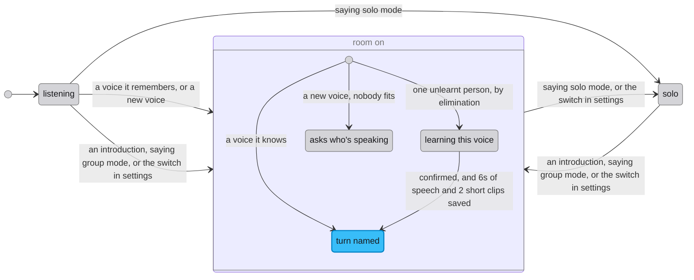

# Voice identification: where it falls short, and what to tune

Crossband can hear you and talk back. When more than one person is in
the room, it also works out who is speaking and puts a name on each
turn. To do that it follows each voice through the conversation on your
own computer, keeps short recordings of each person it has learnt, and
names a voice only when it's sure. The app calls this room mode, and
the readme's
[Have more than one person in the room](../README.md#what-you-can-do)
has the short version.

The defaults were set using the voices of one family. If the app names
the wrong person, or nobody, start with
[What to check when identification misbehaves](#what-to-check-when-identification-misbehaves).

When the app isn't sure who spoke, the turn stays unnamed and says why,
and no cloud service is asked to guess instead. Naming happens on your
computer, and so does splitting the words when two people talk at once.
The only audio that goes to a cloud service is each turn itself, sent
to ElevenLabs to be transcribed, and no stored voice clip goes with
it.

## How a turn is named

Every spoken turn gets the same voice check, whether the room is on,
off or solo, and whichever way the turn was transcribed. Here's what
happens, in order.

1. A voice session starts when you start talking in a chat, and ends
   after 10 minutes with no speech. The app opens a tracking session on
   the diariser, a service on your computer that works out who spoke
   when.
2. While you talk, the app sends the diariser your audio a quarter of a
   second at a time. The silence between turns isn't sent.
3. The diariser gives each voice it hears a number that lasts the whole
   session, for up to 8 voices. That's a session voice. A voice that
   comes back after a long quiet keeps its number.
4. Every stretch of 0.8 seconds or more where one voice speaks alone is
   fingerprinted and added to that session voice, after the
   [bank check](#the-bank-check) and the [span check](#the-span-check).
   Speech where two people overlap never is.
5. After each turn, every session voice is named from all its
   fingerprints so far, one person per voice. A short reply is named
   from everything that voice has said, not from one second of audio.
6. The turn takes the name of the voice that spoke most on its own. The
   name is usually ready a tenth of a second after you stop, and the
   app waits up to 0.8 seconds for it, so the AIs read the name with
   your turn.

A session voice is in one of these states.

| State | When | What the turn shows |
|---|---|---|
| Listening | under 1.5 seconds of clean speech, or nobody clears the bar yet | no name, "still listening" |
| Named | one person clears the bar, and nobody else has that voice | their name |
| Learning | named by elimination at a first meeting | their name, marked learning |
| New | 4 seconds or more of clean speech that matches nobody | no name, "a new voice" |
| TV | someone said it's a TV, a radio or a recording | no name, "the TV or radio" |

When a voice is named later in the session, its earlier turns take the
name too, and the chat updates. A name you set yourself is never
replaced, and neither is a turn with two voices in it.

### Long turns

When you talk for a long time, the app sends your turn in pieces of
about 12 seconds, and each piece tells the app which piece came before
it. The turn is named from all its pieces together. Its main voice is
the one that spoke most on its own across every piece, with the name
that voice has when the turn ends. A second voice that spoke for a
second or more in any piece makes it a two-voice turn, so pieces spoken
by different people never give the turn one name. A last piece too
short to judge adds nothing, and the turn keeps the name its other
pieces earned.

With no diariser, each piece is named on its own and the turn joins
what they found. Pieces named as one person give the turn that name.
Pieces named as different people, or as someone and a new voice, make
it a two-voice turn. A piece that's still listening counts for nobody.

### The span check

The diariser sometimes splits one person into two voices, when their
voice changes, or gives a stretch of one person's speech to someone
else's voice. Before a stretch is added to a session voice, the app
compares its fingerprint with every session voice's. A score says how
alike two fingerprints are, where 1 is identical. The stretch moves to
another voice only when all of these hold:

- that voice has 6 seconds or more of clean speech behind it
- the stretch scores 0.7 or more against it
- it beats every other voice by 0.25 or more, including the voice the
  diariser gave it

A voice the diariser has only just started has nothing to compare, so
a stretch of a split voice can move to the person it plainly is. The
bar is strict, and a normal session moves nothing. A moved stretch
counts for the voice it moved to, and the turn is labelled by that
voice. The session rows at `GET /api/voice/sessions?rows=true` list
every move with its scores.

### The bank check

The span check needs a voice with 6 seconds behind it. Say the
diariser files one person's turn under someone else's voice, and that
person's own voice has said less. The span check can't move it, and
the turn takes the wrong name. The bank check catches that. It runs
once the [calibrated scorer](#how-a-voice-is-named) is ready.

Before a turn's speech is added, the app pools each session voice's
clean speech in the turn. It scores that speech on its own against
everyone's kept clips, and compares it with the person the voice's
earlier speech names. The turn's speech from that voice moves only
when all of these hold:

- there's 1.5 seconds or more of it, as much as naming a voice needs
- on its own it names a known person at 0.99 or more
- the voice's earlier speech names someone else at 0.9 or more
- the turn's speech gives that someone else 0.01 or less
- nobody named the voice by hand

Then every stretch the diariser gave that voice in the turn moves
together, apart from speech over someone else. It goes to the session
voice you named as that person, or else to the voice whose own speech
names them. When there's no such voice, it starts a new voice, named
from its own speech like any other. The voice it came from keeps one
person's speech, and the turn is labelled by the voice it moved to. If
that voice isn't sure yet, the turn shows "still listening".

The bar is strict, and a normal session moves nothing. The check reads
fingerprints the turn already has, so it adds under a millisecond. A
turn too short to fingerprint can't be checked, and takes its voice's
name. The session rows list each move, marked `bank`, with both
chances.

### When a session ends

When the session ends, after 10 minutes with no speech, the app names
every session voice once more from everything it heard. A turn whose
name changed is relabelled, and so is a turn that never got its name,
like the session's last turn. A turn whose voice ends the session with
no name keeps the label it has. This last naming adds or changes a
name, and it never takes one off. A name you set yourself and a turn
with two voices are never touched. The session rows record the pass,
with why the session ended and how many turns it relabelled.

### How a voice is named

Two scorers can name a voice. The calibrated scorer is the one the app
is built around, and it's on once you set `voice_calibrated_scorer`
and its first build has finished. Until then the fallback scorer names
voices.

The calibrated scorer fingerprints each stretch with two speaker
models, TitaNet-Small and ERes2Net. A voice's score against a person
is the average of its three best matches among that person's kept
clips, and the two models' scores are averaged. A calibration fitted
on your household turns that score, and the seconds of speech behind
it, into the chance the voice is that person. Every known person and
someone new start out equally likely. A voice is named at 0.9 or more,
and marked new under 0.1 for everyone.
[When a voice is ready](#when-a-voice-is-ready) says how the
calibration is fitted.

The fallback scorer uses TitaNet-Small alone. It scores a voice against
every clip a person has kept, by the average of their two best clips.
Its bar is the matcher's naming bar, `voice_id_threshold`, moved onto
its own scale by how your household's voices score against each other.
The best person also has to beat the next best by `voice_id_margin`,
scaled the same way.

Either way, a voice is only ever compared with people the app
[remembers](#the-owners-ear), and two voices can't both be the same
person.

### When there's no diariser

The diariser is workbench's diarserve, running
[Nemotron-3-Diarization](https://huggingface.co/nvidia/Nemotron-3-Diarization)
through [NeMo-Speech.cpp](https://github.com/NVIDIA/NeMo-Speech.cpp),
and you point the app at it with `diarize_shadow_url`.
[The diariser](CONFIG.md#the-diariser) in CONFIG.md has the details.

With no diariser set, or with it down, each turn is named on its own.
The whole turn is treated as one voice, with the same scorer, and
nothing is remembered from one turn to the next. Naming still works,
more slowly for short turns, and a turn with two voices in it can't be
split. A diariser that stops answering is logged once, and the app
goes back to tracking the moment it answers again.

## How the room switches on and off

The app keeps a list of who's in the room, called the roster, and
putting a person on that list is called seating them. Switching room
mode on is called arming the room.

The voice dock is the strip that holds the voice controls, and it
shows which of three states a chat is in. "listening" is the default,
where the room is off and the app switches it on by itself when it
hears a reason to. "room on · 2" means the room is on with two people
seated. "solo" means you switched the room off for this chat, and the
app won't switch it back on by itself.

The room arms itself from "listening" when:

- a voice the app remembers is named, and it isn't yours. That person
  is seated.
- a new voice is heard, and the app asks who's speaking. This one needs
  your own voice learnt first, or the app can't tell a stranger from
  you. You're seated beside them.
- someone is introduced out loud
- you say or type "group mode", or use "switch on now" in the voice
  settings

Saying "solo mode" takes the chat to "solo", and so does "switch off
for this chat" in the voice settings. Either one marks everyone as
left and closes any open question about who's speaking. From "solo",
only an introduction, "group mode" or "switch on now" brings the room
back.

In solo the app still checks each spoken turn. Your voice gets your
name, a voice the app remembers gets that person's name, and a voice it
doesn't know is marked "a new voice". Nothing in solo switches the room
on, seats anyone, asks who's speaking or saves a voice clip.

Once the room is on, a remembered voice that isn't seated yet is seated
the moment it's named, before its turn reaches the AIs. When only one
person seated in the room has no voice saved, a new voice is named as
them by elimination and marked learning. When nobody fits, the app asks
who's speaking, once, however long the new voice keeps talking.

```mermaid
stateDiagram-v2
  direction LR
  classDef node fill:#d4d4d8,stroke:#757575,color:#18181b
  classDef hero fill:#38bdf8,stroke:#0284c7,color:#18181b,stroke-width:2px
  classDef boundary fill:transparent,stroke:#757575,color:#757575
  state "room on" as room {
    named: turn named
    learning: learning this voice
    asked: asks who's speaking
    [*] --> named: a voice it knows
    [*] --> learning: one unlearnt person, by elimination
    [*] --> asked: a new voice, nobody fits
    learning --> named: confirmed, and 6s of speech and 2 short clips saved
  }
  [*] --> listening
  listening --> room: a voice it remembers, or a new voice
  listening --> room: an introduction, saying group mode, or the switch in settings
  listening --> solo: saying solo mode
  room --> solo: saying solo mode, or the switch in settings
  solo --> room: an introduction, saying group mode, or the switch in settings
  class listening,solo,learning,asked node
  class named hero
  class room boundary
```

## How room mode hears what you say

The app listens for spoken introductions, like "say hi to Alex" or "my
mate Dave is here", and for the mode commands "group mode" and "solo
mode". It also hears a spoken name correction, a change to how hard a
seat should think, a request for a stronger model, and "research more",
which turns on [research mode](WEB_RESEARCH.md#research-mode). A small,
cheap model reads every turn you send once and says which of these it
holds, so an unusual phrasing lands the same way a common one does. It reads typed
turns as well as spoken ones, whether or not room mode is on.

- Recognising a voice needs no wording at all. The voice check names a
  person the app already knows however they were greeted, whether the
  room is on, off or solo. It holds when live transcription fails too.
  The app then sends each turn's recording to be transcribed, with a
  small copy of the turn's audio for the check, about 32 KB a second.
- The other door is the ask. When a new voice appears and nothing on
  record explains it, the app asks who's speaking. It doesn't guess.
  You answer by saying who it is, as set out in
  [Saying who a new voice is](#saying-who-a-new-voice-is).

When a spoken command switches the room on or off, one system line
says what changed and what to say to undo it. When the model hears an
instruction and the room stays as it was, one system line says so,
naming what it heard and that nothing changed.

Asking the seats to hold back leaves room mode alone. "You don't need
to respond", "just listen" and "go to eavesdropping mode" aren't mode
commands, so the room stays as it was. Each seat answers with `[pass]`
until someone asks it something, and the app hides a pass. When a turn
has a question mark in it, the first seat to reply is asked once whether
the question is for the seats. People in the room asking each other
things get a second `[pass]`, and that one stands. A seat you name still
has to answer. For "solo mode" to be heard, say it by name, or say you're
on your own now, like "it's just me now".

A word you spell out letter by letter only counts as a name correction
when the turn says it's a name. "Her name's spelt S-A-M-M" counts, and
so does "it's Mateo, M-A-T-E-O", where you say the name and then spell
it. Letters on their own don't count, even when they're close to the
name of someone in the room, because a word in a game looks the same.
A word set aside changes nothing and posts no line.

If a turn is never heard as anything, the manual doors always work:
the two switches in the voice settings drawer, "switch on now" and
"switch off for this chat", and typing the command. There's no switch
in the dock itself, which shows the state while the automation does
the arming.

## What the models are told about the room

With every reply it writes, each model gets a short note about the
room. The note says whether room mode is on, whether it can switch
itself back on, and who's in the room. It also counts the names the
voice check put on the last few spoken turns, like "Sam on 3, no name
on 2". When the room switches off, names already on earlier turns
stay, and the note says so.

The models bring up the room only when you ask about it. They answer
from that note and the names on the turns, never from what an earlier
reply said. If you've just asked for room mode on or off, they don't
confirm it or deny it. The app's own line in the chat says what
changed.

The models don't say they can't hear, and they don't mention the voice
check, unless you ask how they know who spoke. Everyone in the room
already knows they read a transcript. Asked who's speaking, they give the name
on the newest turn, or say they don't know yet.

A turn the voice check couldn't name reaches the models as an
unidentified speaker, never as you. Memory treats it the same way, as
a doubted guest's turn. A turn from a voice someone said is a TV
reaches them as background audio, a TV or radio and not a person in
the room, and memory files it as a doubted guest's turn too. Once your own voice is learnt, a spoken turn
only reads as yours when the check named it as you.

Memory gets the naming's score as the speaker's confidence. With the
calibrated scorer that's the chance the voice is that person, so a
fact from a guest's turn links to them by itself only when the app was
80% sure or more.

A named turn of 1.5 seconds or more also gets the mismatch cross-check.
The same cheap model reads the turn beside the recent conversation and
flags a name the words don't fit, like a turn named Sam that talks
about Sam in the third person. The flag shows beside the turn for you
to look at, and it never changes the name. Your own name is checked
only while the room is on.

## When two people talk at once

When a second voice spoke for a second or more in a turn, the turn is
labelled with every voice in it and marked as two voices at once. The
room follows the voice that spoke most on its own. The live
transcription sends the start and end of every word, and each word goes
to the voice speaking at that moment. Under the turn you see who said
which words, like "Alex: are we going / Sam: yes soon".

- A word spoken while both voices were going goes to the turn's main
  speaker, marked unsure, because one microphone can't tell whose it
  was.
- A voice that's still being listened to shows as "Voice 2" with a
  question mark. The AIs read it as an unidentified speaker, never as
  you.
- The note under the turn says some words may be missing. On one
  microphone the quieter voice's words often are.
- Memory never files a two-voice turn under anyone's name, whoever
  spoke.
- No voice clip is saved from a turn with two voices in it.

The word times and the voice tracker each count time from their own
start, and either can restart on its own. The app lines them up at the
end of the turn, the one moment both heard together. If the tracker
heard less of the turn than the transcription did, or the word times
don't come, the turn keeps the two-voices note without the split. A long
turn sent in pieces keeps just the note too, because the word times
cover only its last piece.

The turn waits up to a second for its word times. They come with the
transcript itself, so the split is normally ready before the message is
saved, and the AIs read it with the turn. Tapping the name on a
two-voice turn changes that turn's label and keeps the note. It can't
say which of the voices you meant, so no session voice takes the name.

## Learning a voice

A person's voice is learnt from clips the app saves of them, called
anchors, and one person's set of anchors is their bank. A bank with 6
seconds of clear speech and 2 short clips in it is enough to name
someone, and the app calls such a bank sufficient. The two numbers are
the settings `voice_id_sufficient_seconds` and
`voice_id_min_short_clips`. Only people with a sufficient bank are
compared with a voice.

A clip is saved in only these ways.

- A voice named at 0.99 or more by the calibrated scorer, with 8
  seconds of clean speech behind it, saves the longest clean stretch of
  the turn, 2 seconds or more. The fallback scorer saves at its score
  plus `voice_id_banking_extra`. Either way, at most 3 clips per voice
  per session, and never from a turn with two voices.
- You name or confirm a turn, as set out in
  [Teaching it a voice yourself](#teaching-it-a-voice-yourself).
- Someone says who a new voice is while the app is asking, as set out
  in [Saying who a new voice is](#saying-who-a-new-voice-is).
- Someone the app has just named says their own name.
- Your first introduction, in a room that was off, gives your own
  voice its first clip.
- You record someone on the Voices page, as set out in
  [Recording someone's voice](#recording-someones-voice).

Nothing else is saved: not overlapped speech, not a voice that's still
listening, not a new voice nobody has named, and not a voice named by
elimination alone. A saved clip re-runs the
[hygiene audit](#when-two-people-sound-alike).

### The first meeting

The first meeting is how a new guest gets a name while you sit in the
room already recognised. The room has to be on, with one person seated
whose voice isn't learnt yet, and only one. A new voice can then only
be theirs, so the turn is named as them and marked learning. That's a
name worth using and not yet worth trusting.

Nothing is saved from it. When you tap the turn and confirm the name,
or they say their own name, the turn's audio goes into their bank.
Once their bank is sufficient, ordinary naming takes over.

Elimination is only sound when there's one candidate, so the rule is
kept narrow. It never applies:

- with two or more unlearnt people in the room, which is what the ask
  is for
- when two voices overlap on one turn
- with room mode off, or in solo
- to a voice that's still listening
- in place of a confident name

If the app got it wrong, tap the "learning" label to correct it, the
same as any other label, and the correction feeds the right person.

### Your first introduction

In a room that was off, the app takes the voice that speaks an
introduction or "group mode" to be yours. The voice check keeps the
audio of every spoken turn, so that turn's audio gives your own voice
its first clip, and you're seated. The introduction waits up to 2
seconds for the check to finish with its turn. A typed introduction has
no audio, and seeds nothing. Neither does a turn with two voices in it.
A turn the check heard as someone else seeds nothing either, which
means a name that isn't yours, or a new voice once your own voice is
learnt.

### An introduction outranks a voice match

When someone introduces themselves under a name that isn't a spelling
of anyone the app remembers, the introduction wins over a voice match.
The new person is seated under the name your own ears heard, and the
voice resemblance becomes a merge question for you to answer. If the
name could be a spelling of a remembered person's name, in any form
the app has recorded for them, a confident voice match still
re-identifies them quietly, because that's the same human. "Sounds
like Sam" has banked the wrong person before, and one tap on a
question is cheaper than an afternoon of stolen turns.

A model's name can never be seated as a person. The models are
addressed by name in nearly every spoken sentence, and a mishearing
like "This is Claude..." looks like an introduction. Elimination is
only as sound as the roster it reads. If that mishearing seated the
model as a person, elimination would learn a human voice under the
model's name, until a person who doesn't exist was a remembered voice.
The app spots your own name in its misspelt forms, and it spots a
model's name the same way. Any such name is dropped before seating,
and the seat writer refuses the exact names outright as a final guard.
Your own name never creates a second you, however it's misheard.

## How a bank keeps its clips

A bank holds up to 10 clips longer than two seconds and 5 shorter
ones. The short clips give a one-word remark something like itself to
match. A clip is at most 10 seconds long, and a longer turn keeps the
10 seconds that hold the most speech. Once a bank is full, a new clip
has to win a place, and the clip that loses is deleted. That's
rotation.

Rotation keeps clips from as many sittings as it can. The app groups a
person's clips into sessions, where a session is a run of clips with
no gap of more than two hours between them. A new clip competes with
its own session's clips first. Every session keeps its best clip
before any session keeps a second, so one long evening can't push out
the clips from other days. Inside a session, the longer and louder
clip wins, and the newer clip wins a tie.

A clip a human stood behind never makes way for an automatic one. That
covers a clip from an introduction, a clip from a turn you corrected,
and a clip you moved into the bank yourself. If a bank has more of
those than it can hold, they compete with each other by the same rule.

A fingerprint is built from the speech in each clip. A pause longer
than about half a second is left out, and the gaps between words stay
in. The stored clip keeps its pauses, so a clip you play back on the
Voices page sounds as it was recorded. A clip with less than a second
of speech in it is used whole.

### When a voice settles

Once a voice is established, its bank settles and stops churning. With
`voice_calibrated_scorer` on, established means the readiness test in
[When a voice is ready](#when-a-voice-is-ready) says the voice is
ready. With the test off, or before its first check has finished, it
means the bank has enough speech and at least 10 clips from at least
two days.

A settled bank takes an automatic clip at most once a week. The clip
has to come from a day the bank doesn't hold yet, or score better than
the weakest automatic clip of its length. It then takes that clip's
place, so the bank doesn't grow. When a length still has room, the
clip fills the gap, and that uses up the week's turn too. Every other
automatic clip is refused. The refusal is counted with the person's
other refusals under the reason "voice is settled", and the voice
dock's learning line calls the voice settled.

A clip from an introduction, a correction or a recording you make on
the Voices page always goes in, settled or not, and so does a clip
you move into the bank. An automatic clip never pushes out a clip a human
stood behind. A bank that isn't established keeps learning by
rotation, as it always has.

## Teaching it a voice yourself

Tap the name on a turn and pick someone to correct it. The name
changes, and the turn's audio goes into that person's bank as ground
truth. To confirm a name that's right, pick "Yes, that's Sam: learn
from this". The name stays, and the app learns from that turn whatever
it scored. Either way the bank counts as vouched, and the clip is kept
through rotation. To give a voice a lot of clean speech at once,
record them reading a passage, as set out in
[Recording someone's voice](#recording-someones-voice).

Naming a turn by hand also names its session voice for the rest of the
session. The voice's other turns in the session that carry no name
take the name at once, and later turns from that voice are named
straight away.

The app keeps the audio of the last 24 turns in memory, up to the last
30 seconds of each, so confirm soon after the turn. When the recording
has gone, the turn says so and nothing is learnt. A turn with two
voices in it is never learnt from. If the voice on the turn matches
yours, the turn is labelled with your name, and the line under it says
so.

A remembered voice that says its own name teaches the app the same
way. When someone the app has just named Sam says "this is Sam" or "my
name is Samuel", the turn's audio goes into Sam's bank as an
introduction. A rename in the same breath still happens. The words and
the voice have to agree, so Sam saying Dave's name feeds nobody's
bank.

### Saying who a new voice is

When a new voice has 4 seconds of clear speech and matches nobody, the
app asks "Someone new is talking. Who's this?" You can answer out loud,
or type it. Say "that's Dave", or let the new person say "I'm Dave".
The answer does what tapping the turn does. The turn the question
points at is named Dave, and it's marked as an introduction. The voice
is Dave for the rest of the session, and its other turns take the name.
The turn's audio goes into Dave's bank as an introduction, so the bank
counts as vouched.

Who says it matters. The new voice names itself with "I'm Dave", "it's
Dave", "my name's Dave" or "Dave here". You, or anyone the app has
already named, name it with "that's Dave" or "it's Dave". "I'm Dave"
from a named person is about the speaker, so it leaves the question
open. A voice the app hasn't named yet might be a second new person, so
its words don't answer the question either.

The answer needs the question to be open and to point at a turn with
one voice in it. When it isn't, "that's Dave" is an ordinary
introduction. Dave joins the room, and the question closes. Your own
name, a spelling of it, a model's name and a relationship word never
answer it. In solo the app doesn't ask, so there's nothing to answer.

While the question is open, the small model that reads every turn is
told the app has asked, so it hears "that's Dave" as the answer. Every
other turn is read the way it always is.

### When it's the TV

A TV, a radio or a video playing near the microphone can be a new voice
too, and the app asks about it the same way. Answer "that's the TV",
"it's just the radio" or "that was a video", out loud or typed. That
voice is then ignored for the rest of the voice session. It's never
named, seated, asked about again or learnt from. Anything it says that
sounds like an instruction, like a show saying "this is Dave", changes
nothing.

Its turns stay in the chat with no name on them, and its earlier turns
in the session lose the "new voice" note. The models read them as
background audio, a TV or radio and not a person in the room, so they
don't answer it as someone talking to them. A turn where someone talks
over the TV still shows both voices.

It lasts until the voice session ends, so a TV that's still on in the
next session may be asked about again. If you got it wrong, tap one of
its turns and pick a name, and the voice takes that name as with any
tap. With no diariser there's no session voice to follow, so only the
turn the question points at is marked. The new voice itself saying
"that's the TV" marks nothing, since that's a person pointing at one.
When the app isn't asking, "that's the TV" changes nothing, and a line
in the chat says so.

## When a voice is ready

The Voices page can tell you whether each stored voice is ready, which
means the app should name that person on a day it hasn't heard them
yet. Turn it on with `voice_calibrated_scorer` in [CONFIG.md](CONFIG.md)
and restart the app. The same setting turns on the calibrated scorer
that names voices.

The test cuts the speech in a person's clips into 2 second pieces. It
takes each day's clips out of their bank in turn, and checks whether
that day's pieces are still named as them. A voice is ready when at
least 95 pieces in 100 are named as them, none is named as anyone else,
and there are at least 20 pieces. Seconds count speech, never the
pauses, and clips the hygiene guard set aside count for nothing.

The page shows "Ready" or what the voice still needs.

- "Needs more speech: 12 of 20 pieces" means there isn't enough stored
  speech to test yet.
- "Needs speech from another day" means every clip comes from one day.
  With that day taken out there's nothing left to test against, so the
  app has to hear them on another day.
- "2 of 30 pieces sounded like someone else" means some of their pieces
  were named as another person. Listen to their clips, because one may
  be someone else's voice.
- "87% of pieces named right, 95% needed" means too many pieces were
  left unnamed.

A voice that isn't ready can still be named in a session, once its
session voice has enough speech behind it.

### Recording someone's voice

Most banks hold too little clean speech to be ready, since clips only
arrive when a voice chat is sure who spoke. You can fill a bank
yourself. On the Voices page, press "Record their voice" beside the
person, sit them at the microphone and press Start. They read the
short passage on screen, which takes about 30 seconds, and the meter
moves while the app hears them. Press Stop when they finish, or it
stops by itself at 45 seconds. It records with the same microphone
setting a voice chat uses.

The app checks the recording is speech, trims the silence off both
ends, and cuts it into clips of up to 10 seconds at the pauses. Each
clip is kept as an introduction. The bank counts as vouched, and
rotation keeps these clips ahead of the ones the app collects itself.
A recording that's mostly noise, silent, or under 10 seconds of speech
is turned away with the reason, and nothing is kept. You can listen to
the new clips and delete one like any other, and Forget removes them
too.

Straight after, the page says how much it kept and checks whether the
voice is ready. That takes a few seconds while the test fingerprints
the new clips. If the voice isn't ready, the page says what's missing.
When it needs speech from another day, or too few pieces were named
right, record again on another day or in another room. A second
setting is what the test is missing. With `voice_calibrated_scorer`
off, the clips are still kept and the page skips the check.

A voice chat that's still listening would hear the reading too, so the
recorder won't start until you end it. The next recording of the same
person shows a different passage. The audio goes only into the app's
own store of clips, and from there to membro with every other clip.

`POST /api/voice/people/{person_id}/record` takes the recording as a
16 kHz mono WAV. `GET /api/voice/people/{person_id}/readiness` gives
the person's result and says whether it covers their clips as they
are now.

### How the calibration is fitted

The calibration learns from your own clips. Pieces of 1, 2, 4 and 8
seconds are scored against every bank, with the piece's own day left
out of its own person's bank. Against everyone else's bank, a piece
shows what a voice the app doesn't know looks like. A short clip cut
from a longer turn leaves with that turn's clip. For a person whose
clips all come from one day, each clip leaves on its own.

The work runs on its own thread, at startup and after every change to
a bank, and lets any live voice check go first. The first run after a
start takes a few minutes, and later runs only fingerprint new clips.
After each run, the same thread moves older clip scores into its units
and runs the [hygiene guard](#how-the-guard-judges-a-clip).
Fingerprints stay in memory and are never written anywhere.
[ERes2Net](https://github.com/modelscope/3D-Speaker) is a speaker model
from the 3D-Speaker project under the Apache 2.0 licence. It's about
26MB, downloaded once from the sherpa-onnx releases into
`<data_dir>/voice_models/` and checked against a pinned SHA-256 before
first use.

`GET /api/voice/people` gives each person's result as `readiness`: the
pieces tested, the share named right, how many were named as someone
else, the days and the seconds of speech. The answer's own `readiness`
field holds the test's state and its rules.

## English bias

Two separate parts lean English. The first is the one model call that
reads every turn, so an introduction, a command, a correction, a depth
change or a research request spoken in another language will often not
be recognised.
Use the switches in the voice settings drawer, or type the command.
Recognising a voice the app already knows still works in any language,
because it listens to the voice and not to the words.

The second is the speaker models, which ship trained on English, and
every bar here was set with English speech. Naming goes on how a voice
sounds more than on what it says, so other languages are expected to
work. Nobody has measured them, so the calibration promises hold for
English only.

When the app can't name a turn, the turn stays unnamed, and the turn
says why in the words the voice panel uses: "still listening" or "a new
voice". The seats read that reason, so when you ask who's speaking they
can say what stopped the name.

## The models themselves

The fallback scorer runs `nemo_en_titanet_small`, Nvidia's
[NeMo TitaNet-Small](https://catalog.ngc.nvidia.com/orgs/nvidia/teams/nemo/models/titanet_small)
speaker model, which the app calls the matcher. The hygiene audit uses
it too while the calibrated scorer is off. It's about 38MB and
licensed
[CC-BY-4.0](https://creativecommons.org/licenses/by/4.0/), which lets
anyone use it as long as Nvidia is credited. It runs on your computer
through
[sherpa-onnx](https://k2-fsa.github.io/sherpa/onnx/index.html), an
open-source speech toolkit. The app pins the model by its download
address and its SHA-256, a hash of the file that changes if a single
byte does. It fetches the file once from the sherpa-onnx releases into
`<data_dir>/voice_models/` and checks that hash before first use. Once
the file is there, the app loads it in the background every time it
starts, and embeds everyone's saved clips while it does, so the first
turn after a restart can be named.
`GET /api/voice/health` reports the live model's file name, the start
of its hash, and whether the built-in pin was overridden.

The matcher also answers two narrow questions about a whole turn. When
you tap a turn to correct it, it checks whether the voice is your own,
so a misheard spelling of your name never mints a second you. When
someone introduces themselves, it checks whether the voice is someone
the app remembers.

You can swap the pin: `voice_id_model_url` and `voice_id_model_sha256`
in [CONFIG.md](CONFIG.md) override it together, both or neither. A new
address checked against the old hash fails verification, and the
matcher stays unavailable. It never runs an unverified file.

Before you swap, know what a swap costs.

- The fallback scorer's bar was set for TitaNet-Small's scores. A
  different model needs its own, using the knobs in
  [The tuning knobs](#the-tuning-knobs).
- Stored voices survive a swap on their own, because the app keeps the
  anchor clips and never the model's output. A voice fingerprint lives
  only in memory and is rebuilt from the clips by whichever model is
  loaded, so after a swap and a restart there's nothing to migrate and
  no mixed comparisons. The calibration refits from the same clips.

## The tuning knobs

The full list, each knob with its default and what it controls, is
the Voice table in [CONFIG.md](CONFIG.md). Every one can be set in
`config.local.json` or as a `CROSSBAND_*` environment variable. The
defaults may need moving when voices in your house sound alike, like
siblings or a parent and an adult child. They were set on the model's
published benchmarks plus the voices in one home.

Change one knob at a time, and check the voice dock first. Its top
row leads with the room state ("room on · N", "listening" or "solo").
Next comes one chip per person seated in the room, which shows a tick
once their voice is remembered, or "learning 4s" while it's still being
learnt, and the row ends with how fast the last turn was identified.
While the room is off, the only chip is yours, once the app has started
learning your voice. Everyone it remembers is listed on the Voices
page. The tick describes the stored voice and says nothing about the
turn being spoken. Each turn's own label shows who it was named as, and
a hard turn can stay unnamed under a green tick. The matcher's own
state and any "sound close" warning sit behind the settings button
beside the controls, along with the manual room switches.

## When two people sound alike

Two people who sound alike are the hardest case. The app is built to
stay quiet when in doubt, so when it can't tell them apart it leaves
the turn unnamed.

- The hygiene guard audits the stored voices whenever they change. A
  stored clip that sounds more like a different person than its own
  is set aside, kept on disk, shown as "clips set aside" under
  Remembered voices, and left out of naming.
  [How the guard judges a clip](#how-the-guard-judges-a-clip) has the
  rule. Two people whose stored
  voices sit too close are flagged behind the settings button ("Alex
  and Sam sound close - matching is stricter"), and the matcher's own
  checks demand a wider margin between those two.
- One person per voice stops two voices both taking one name, and the
  calibrated scorer waits until one person is clearly likelier.
- With the fallback scorer, raise `voice_id_margin` first, then
  `voice_id_threshold`. Expect more unnamed turns in exchange for fewer
  wrong names. No setting buys certainty for free.
- Tapping a named turn to correct it fixes the label and feeds the
  corrected audio to the right person as ground truth. That's the
  fastest way to pull two confusable voices apart.

### How the guard judges a clip

With the calibrated scorer on, the guard asks the scorer that names
voices. Each stored clip is scored against every other person's clips,
and against the rest of its own person's. The clips cut from the same
turn are left out of their own bank together, since a slice can't
vouch for its own turn. The clip is set aside when someone else scores
higher. Every clip is judged against every clip, set aside or not, so
the same banks always get the same answer. The guard runs after each of
the scorer's builds, and a build follows every change to a bank.

With the scorer off, or before its first build, the guard uses the
matcher alone. A clip is set aside when it sits closer to another
person's average fingerprint than to its own person's, with the clip
itself left out.

Either way, a clip that isn't speech at all is set aside first. The
close pairs always come from the matcher's average fingerprints,
because the matcher's own checks are what widen the margin for them.

## The owner's ear

The hygiene audit can't catch a bank that is wholly someone else's
voice under the wrong name, because every clip in it agrees with every
other. It compares clips in pairs, so what it catches is a bank with
someone else's clips mixed in. A bank that's wholly wrong has one
shape. It reached enough speech without a single spoken introduction
or correction from you, by automatic saves alone.

A bank is vouched the moment a human stands behind it, which happens
when an introduction banks into it, when you correct or confirm a turn
into it, or when you record them on the Voices page. The stamp is on
the person, so it survives [rotation](#how-a-bank-keeps-its-clips)
and merges.

A sufficient bank nobody vouched for asks for your ear under
Remembered voices: listen to its clips and confirm. Until you do, a
bank the app watched become sufficient is paused. A paused bank is
left out of the people a voice is compared with, so it can neither name
nor seat anyone in a session. Every voice check builds that list the
same way, so no path can drift.

The one exception to the pause is a person already seated in the live
chat. They keep being named, because the pause guards re-seating and
leaves the seat alone. A real person unlocks a paused bank at once by
introducing themselves, since the introduction vouches the bank. A
bank that was already sufficient before the app began recording that
crossing keeps working while flagged, so an upgrade takes nothing away.

Vouching can also be outlived. Each time the app saves a clip by
itself, it records the score the voice was named at. Rotation keeps the
clips a human stood behind, but you can delete or move them, and the
hygiene guard can set them aside. When none is left in the bank, those
scores decide the bank's standing. Weak scores pause naming until your
ear confirms the voice again, and strong scores keep it working, with a
note under Remembered voices. The exception for someone already seated
applies to this pause too. Clips stored before scores were recorded
carry none, and a bank made of those keeps working.

Weak means a middle score under the bar, and the bar depends on the
scorer. With the calibrated scorer, a clip's score is the chance its
voice is that person, and the bar is 0.5, more likely them than not.
A clip is saved when its voice is named at 0.99, but one clip on its
own is much less sure than a whole session's speech. With the fallback
scorer, the score is the matcher's and the bar is 0.6, the score it
saves a clip at. A voice that saves its clips cleanly keeps working
either way, even when its scores never run high.

A clip saved by the fallback scorer carries the matcher's score. After
each of the calibrated scorer's builds, any clip still scored that way
gets its chance instead, once. The clip is scored whole against every
bank, with the clips cut from its own turn left out of its own. The old
score is kept beside the new one, and nothing else about the clip
changes. A bank holding both kinds of score is judged by how far each
one clears its own bar.

## The durable home

Learnt voices have a second home in
[membro](https://github.com/shawn-durrani/membro), the optional memory
service that remembers from one conversation to the next. With membro
set up (`MEMORY_AUTH_TOKEN` in the environment), a background pass
uploads accepted clips to membro's person records, pulls in people
this install doesn't hold, and obeys forget marks. A bank that isn't
full or settled gets clips back from membro, a few each pass, and each
one keeps the day it was recorded, so it rejoins that day's session. The pass
then asks the hygiene guard to check them. Forgetting a person
in either app deletes the stored audio in both. The pass runs at
startup, after rounds, and the moment you forget someone, always on a
worker thread that no turn waits for. If membro is down, the pass logs
once and does nothing. Naming never waits on it.

Your corrections travel too. Moving a clip to the right person,
deleting one, merging duplicate people, or forgetting someone here is
recorded and replayed against membro on the next pass. The durable
record then reflects your judgement, and a rebuild can never bring
back a recording you corrected away. A correction made while membro
is down waits for the next pass.

Forget doesn't wait for that pass. It sends the forget the moment you
press it, and a later pass retries one membro couldn't take. Membro
deletes its copy of the audio and sends the facts it learned from that
person back to review. Forgetting someone also settles any waiting
correction that named them. The other record in a merge they won is
forgotten too, and a clip moved into them is deleted at its source.
Merging two people settles them the same way, and a waiting
correction that named the merged-away person now names the survivor.

### What membro keeps

Membro keeps a copy of the clips each bank holds. When rotation drops
a clip, when a settled bank replaces one, or when the hygiene guard
sets one aside, the next pass deletes membro's copy too. The drop
travels in the same record as your own deletes, so a rebuild can't
bring it back, and a clip still waiting to be deleted there is never
handed back to a bank. Membro writes down why each one went, as
rotation, settled or set aside. If membro loses its copy of a clip a
bank still holds, the next pass uploads it again.

A clip the hygiene guard sets aside stays on this computer, out of
matching. If a later check puts it back in use, the next pass uploads
it again. Membro doesn't keep set-aside clips, because a rebuild from
membro has no way to know they were set aside and would match with
them straight away. The cost is small. If this computer's data were
lost while a clip was set aside, that clip would be gone, and it was
the doubtful one.

A pass that hands clips back from membro deletes nothing there. If a
clip it hands back pushes another out of the bank, membro keeps that
one until you delete it on membro's side.

Each pass also sends membro the list of clips every bank holds, by
their content hash. Membro's People page counts, for each person, the
stored clips that aren't on the list, and deletes them only when you
press the button there. Any clip membro holds that no bank does counts
there, whatever dropped it. The list needs membro's memory contract
1.8. An older membro gets no list, and every drop still
reaches it.

## Scale bounds

- The roster holds 6 people at once by default (`room_roster_max`),
  and the cap frees as people leave. It's a product choice, and
  nothing technical forces it. Past the cap a remembered voice is still
  named, and the roster just doesn't grow.
- The diariser follows up to 8 voices in a session. The roster cap
  keeps real sessions under that.
- A session's voices live in memory only, and are dropped when the
  session ends. Only clips saved by the rules for learning stay.
- One Crossband instance belongs to one person, and everything about
  memory, spend and trust assumes it. Guests are remembered voices
  with names, never co-owners. That's how the whole fleet is built,
  and no knob changes it.

## What to check when identification misbehaves

1. The voice dock's settings button. On a phone, tap the one-line
   summary to open it. Is the matcher `ready`? A `fetching` or
   `unavailable` matcher means no turns are named, and nothing arms by
   itself until it recovers.
2. The diariser. `GET /api/voice/sessions` shows whether the feed is
   on, the diariser's last answer, and each recent turn with the name
   its voice had then and at the end of its session. A diariser that's
   down means each turn is named on its own.
3. The chips on the dock's top row, and Remembered voices on the
   Voices page. Does each person show a tick, or are they still
   learning? Are clips set aside? Is there a "sound close" warning? Is
   each voice ready?
4. The knobs, one at a time.
5. If a name is wrong, tap the name on the turn and correct it. The
   correction is final, and no automated step will change it back.
